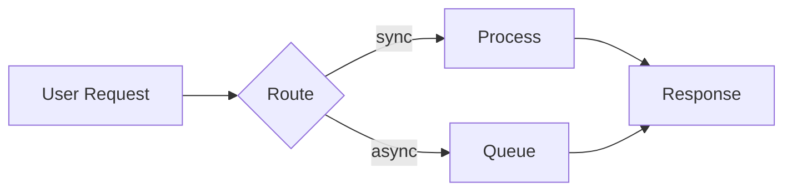

# Documentation Guide (Diataxis Framework)

Developer-facing documentation follows the [Diataxis](https://diataxis.fr/start-here/) framework that divides documentation into four categories: tutorials, how-to guides, reference, and explanation. Each has a different purpose and needs to be written in a different way.

**Never mix documentation types.** Each type serves a fundamentally different user need and must remain separate. Blurring boundaries is the root cause of most documentation problems.

## The Four Documentation Types

### 1. Tutorials (Learning-Oriented)

**Purpose**: Guide beginners through a complete learning experience\
**Audience**: New users acquiring basic competence\
**Focus**: Practical lessons that build confidence through successful completion

**Characteristics**:

- Take users step-by-step through a concrete project
- Always reach a meaningful, working conclusion
- Prioritize learning over explaining _why_
- Avoid distractions, alternatives, or edge cases
- Ensure every step produces expected results
- Use concrete examples, not abstractions

**Structure**:

```markdown
# Tutorial: [Specific achievable goal]

## What you'll build
[Concrete outcome description]

## Prerequisites
[Exact requirements - versions, tools, accounts]

## Step 1: [Action verb]
[Concrete instruction]
[Expected result]

## Step 2: [Action verb]
[Continue with clear steps...]

## Summary
[What they accomplished, what they learned]
[Links to related how-to guides and explanations]
```

**Writing guidelines**:

- "Now run `train.py` - you'll see the training loss decreasing"
- "We use HTTPS here because it's more secure ([learn more](link))"
- Don't explain concepts in depth - link to explanations instead
- Don't show alternative approaches - stay focused on one path
- Don't assume prior knowledge beyond prerequisites

---

### 2. How-To Guides (Task-Oriented)

**Purpose**: Help competent users accomplish specific real-world tasks\
**Audience**: Experienced users solving practical problems\
**Focus**: Efficient solutions to common problems

**Characteristics**:

- Address a specific goal or problem
- Assume user competence and familiarity
- Show the steps, skip the explanation
- Allow users to adapt to their context
- Don't need to be comprehensive end-to-end

**Structure**:

````markdown
# How to [solve specific problem]

## Problem
[Clear description of what this solves]

## Prerequisites
- [Assumed knowledge/setup]

## Steps

1. [Do specific action]
```bash
   [exact commands]
```

2. [Next action]
   [Brief context if needed]

3. [Continue...]

## Verification
[How to confirm it worked]

## Troubleshooting
[Common issues and fixes]

## See also
- [Related how-to guides]
- [Relevant reference documentation]
````

**Writing guidelines**:

- Use conditional imperatives: "To achieve X, do Y"
- Focus on the task, not the tool
- Link to reference for complete option lists
- Don't explain why unless critical to success
- Don't teach - assume they know the basics
- Don't provide full end-to-end setup

---

### 3. Reference (Information-Oriented)

**Purpose**: Provide accurate technical descriptions for users at work\
**Audience**: Users who need to look up specific facts\
**Focus**: Comprehensive, accurate, consistent information

**Characteristics**:

- Describes the machinery/API/system as it is
- Factual, neutral, free of opinion
- Structured to mirror the code/system architecture
- Designed for quick lookup during work
- Complete and authoritative

**Structure**:

````markdown
# [Module/Class/Function] Reference

## Overview
[One-sentence description]

## Signature
```python
def train_model(
    config: TrainingConfig,
    data_path: str,
    *,
    checkpoint_dir: Optional[str] = None,
    distributed: bool = False
) -> TrainingResult
```

## Parameters

### config (TrainingConfig)
[Neutral description of what it is and what it controls]

### data_path (str)
[Description]

## Returns

### TrainingResult
[Description of return value]

## Raises

### ValueError
[When this is raised]

## Examples
```python
# Basic usage
config = TrainingConfig(batch_size=32, lr=0.001)
result = train_model(config, "/data/training")
```

## See Also
- [Related functions]
- [How-to guide for common usage]
````

**Writing guidelines**:

- Be accurate and complete
- Follow consistent structure
- Mirror code/system organization
- Include minimal illustrative examples
- Don't explain concepts - link to explanations
- Don't provide instructions - link to how-tos
- Don't include opinions or recommendations

---

### 4. Explanation (Understanding-Oriented)

**Purpose**: Deepen understanding of topics and design decisions\
**Audience**: Users wanting to understand "why" and context\
**Focus**: Clarification, discussion, multiple perspectives

**Characteristics**:

- Discusses concepts, design, alternatives, context
- Can include opinions and perspectives
- Approaches topics from multiple angles
- Not tied to specific tasks or code
- For study, not for work

**Structure**:

```markdown
# [Topic] Explained

## Overview
[What this explanation covers and why it matters]

## Context
[Background, history, or situation that motivates this topic]

## [Key Concept 1]
[Discussion of concept with examples]

### Why this matters
[Implications and reasoning]

## Trade-offs and Alternatives
[Compare different approaches]

## Common Misconceptions
[Clear up confusion]

## Conclusion
[Synthesis of key insights]

## Further Reading
- [Related explanations]
- [Academic papers or external resources]
```

**Writing guidelines**:

- Circle around the topic from different angles
- Make connections to other concepts
- Provide context and history
- Include diagrams and comparisons
- Express informed opinions when helpful
- Don't give step-by-step instructions
- Don't turn into reference material with tables of facts

---

## Quick Decision Guide

1. **Is the user learning or working?**
   - Learning -> Tutorial or Explanation
   - Working -> How-to or Reference

2. **Do they need to follow steps?**
   - Yes, learning -> Tutorial
   - Yes, solving problem -> How-to

3. **Do they need facts or understanding?**
   - Facts to use -> Reference
   - Understanding -> Explanation

## Documentation Workflow

### When Writing New Code

1. **Identify which documentation types need updates**
   - New feature -> Tutorial (if fundamental) + How-to + Reference
   - Bug fix -> Update relevant How-to or Reference
   - API change -> Always update Reference
   - Design decision -> Add/update Explanation

2. **Update each type appropriately**
   - Keep types separate (no explanations in tutorials!)
   - Update related cross-links
   - Ensure examples still work

3. **Verify documentation matches code**
   - Test all code examples
   - Validate parameter descriptions
   - Confirm error messages match

### Directory Structure

```text
docs/
├── tutorials/           # Learning-oriented lessons
│   ├── getting-started.md
│   └── first-training-job.md
├── how-to/             # Task-oriented guides
│   ├── configure-distributed.md
│   ├── monitor-memory.md
│   └── troubleshooting.md
├── reference/          # Information-oriented specs
│   ├── api/
│   ├── cli.md
│   └── config-options.md
└── explanation/        # Understanding-oriented discussion
    ├── architecture.md
    ├── training-strategies.md
    └── design-principles.md
```

## Common Mistakes to Avoid

**Tutorial mistakes**:
- Explaining concepts in depth (use brief notes + links)
- Showing multiple ways to do things
- Skipping steps or assuming knowledge beyond prerequisites
- Not testing that each step produces expected results

**How-to mistakes**:
- Teaching basics (assume competence)
- Explaining why things work (link to explanations)
- Making it comprehensive end-to-end (focus on the task)

**Reference mistakes**:
- Including "how to use this" instructions (link to how-tos)
- Explaining design decisions (link to explanations)
- Using inconsistent structure
- Being incomplete or ambiguous

**Explanation mistakes**:
- Providing step-by-step instructions (link to tutorials/how-tos)
- Just listing facts (that's reference)
- Staying too abstract without examples

## Cross-References

Create clear pathways between documentation types:

- **From Tutorials**: Link to related how-tos and explanations for "next steps"
- **From How-tos**: Link to reference for complete options, explanations for context
- **From Reference**: Link to how-tos for common usage patterns
- **From Explanations**: Link to tutorials and how-tos for practical application

## Quality Checklist

Before committing documentation changes, verify:

- [ ] Content is in the correct documentation type
- [ ] No mixing of types (e.g., no explanations in tutorials)
- [ ] Code examples are tested and work
- [ ] Cross-references are updated
- [ ] User need is clearly served
- [ ] Writing style matches the type (instructive vs. informative vs. explanatory)

## Diagrams

Add diagrams where they help achieve learning objectives or clarify complex concepts. Visual representations are especially valuable for:

- System architecture and component relationships
- Data flow and execution sequences
- State machines and lifecycle diagrams
- Decision trees and branching logic

**Preferred format**: Use [Mermaid.js](https://mermaid.js.org/) diagrams embedded in markdown. Mermaid is natively supported by MkDocs Material and renders directly in documentation.

````markdown

````

**Docstrings with diagrams**: Public API docstrings can include Mermaid diagrams, markdown formatting, and ASCII art. These are rendered in the reference documentation via mkdocstrings. Use diagrams in docstrings when they help users understand:

- Method call sequences
- Object relationships
- State transitions
- Complex return structures

**When to use ASCII art**: For simple inline diagrams in docstrings where Mermaid would be overkill, ASCII art is acceptable:

```python
def process_pipeline(self):
    """Run the processing pipeline.

    Pipeline structure:
        Input -> [Preprocess] -> [Transform] -> [Validate] -> Output
                      |               |
                      v               v
                   Logs           Metrics
    """
```
