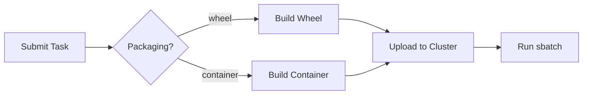

# Repository Guidelines

## Project Structure & Module Organization
- `src/slurm/` hosts the core SDK: job orchestration (`cluster.py`, `job.py`), decorators (`task.py`), packaging utilities, and renderers. Keep new modules under this package with explicit exports in `__init__.py`.
- `src/slurm/examples/` contains runnable usage samples; mirror this pattern when adding new tutorials.
- `tests/` holds pytest suites with shared fixtures in `tests/conftest.py` and helpers under `tests/helpers/`.
- `docs/` and `mkdocs.yml` drive the MkDocs site; place new guides under `docs/` and add navigation entries in `mkdocs.yml`.
- Project configuration lives at the repository root (`pyproject.toml`, `uv.lock`, `README.md`).

## Build, Test, and Development Commands
- `uv pip install -e .` installs the package in editable mode for local development.
- `uv run pytest` executes the offline unit suite against the local backend.
- `uv run python -m slurm.examples.hello_world` performs a smoke test of job submission without SLURM access.
- `uv run mkdocs serve` launches the documentation preview at `http://127.0.0.1:8000`; stop with `Ctrl+C`.
- `uv run mkdocs build` builds the documentation and checks for warnings and errors.
- `uv format` formats code according to project style guidelines.
- `uv run ruff check --fix` lints the code and auto-fixes issues where possible.

## Coding Style & Naming Conventions
- Use 4-space indentation and type hints throughout; the package ships `py.typed`.
- Follow Google-style docstrings for public APIs and mirror existing logging patterns (`slurm.logging.configure_logging()`).
- Prefer snake_case for functions, PascalCase for classes, and keep module names lowercase.
- Avoid restructuring logs: reserve INFO for user-facing messaging and DEBUG for internals.


## Code Comments Guidelines

### Prefer "Why" Over "What"

Code should be self-documenting through clear naming and structure. Comments should explain **why** decisions were made, not **what** the code does.

❌ **Bad (what-style)**:
```python
# Increment counter by 1
counter += 1

# Loop through users
for user in users:
    # Check if user is active
    if user.is_active:
```

✅ **Good (why-style)**:
```python
# Increment before check to avoid off-by-one error in batch processing
counter += 1

# Process only active users to prevent sending notifications to deactivated accounts
for user in users:
    if user.is_active:
```

### When to Use What-Style Comments

Use what-style comments **only** when code is necessarily complex or unintuitive:

- **Non-obvious algorithms**: `# Binary search to achieve O(log n) lookup`
- **Performance optimizations**: `# Cache miss forces full table scan here`
- **Domain-specific logic**: `# SEC regulation requires T+2 settlement`
- **Working around limitations**: `# PyTorch autograd doesn't support in-place ops here`
- **Complex mathematical operations**: `# Haversine formula for great-circle distance`
- **Regex patterns**: `# Match ISO 8601 datetime with optional timezone`

### Best Practices

- **Delete obvious comments**: If the code is clear, no comment is better than a redundant one
- **Explain decisions**: Why this approach over alternatives? What tradeoffs were made?
- **Document assumptions**: What must be true for this code to work correctly?
- **Flag technical debt**: `# TODO: Refactor when API v2 launches` with context
- **Keep comments up to date**: Outdated comments are worse than no comments

**Rule of thumb**: If you can make the code clearer instead of adding a comment, refactor the code.

## Changelog Management

When modifying code, always update `CHANGELOG.md` following the [Keep a Changelog](https://keepachangelog.com/en/1.1.0/) format:

### Format Requirements

- **File**: `CHANGELOG.md` at project root
- **Date format**: ISO 8601 (YYYY-MM-DD)
- **Structure**: Reverse chronological (newest first)
- **Semantic versioning**: Link to [semver.org](https://semver.org/spec/v2.0.0.html)

### Entry Categories

Classify all changes under these headings:

- **Added**: New features
- **Changed**: Changes in existing functionality  
- **Deprecated**: Soon-to-be removed features
- **Removed**: Now removed features
- **Fixed**: Bug fixes
- **Security**: Vulnerability fixes

### Workflow

1. **During development**: Add entries to `## [Unreleased]` section
2. **At release**: Move `[Unreleased]` entries to new versioned section `## [X.Y.Z] - YYYY-MM-DD`
3. **Format**: Use bullet points (`-`) with descriptive, user-focused language
4. **Audience**: Write for end users, not developers - explain *what* and *why*, not implementation details

### Example Structure
```markdown
# Changelog

All notable changes to this project will be documented in this file.

The format is based on [Keep a Changelog](https://keepachangelog.com/en/1.1.0/),
and this project adheres to [Semantic Versioning](https://semver.org/spec/v2.0.0.html).

## [Unreleased]

### Added
- New API endpoint for batch processing requests
- Support for concurrent job execution with configurable worker pools

### Fixed
- Memory leak in long-running data pipeline operations

## [1.2.0] - 2025-01-15

### Added
- REST API for job management
- Webhook notifications on job completion

### Changed
- Improved error messages with actionable resolution steps
- Database connection pooling now uses exponential backoff

### Deprecated
- Legacy `/v1/process` endpoint (use `/v2/jobs` instead)

## [1.1.0] - 2025-01-01

### Added
- Initial release with core processing capabilities
```

### Key Principles

- ✅ **Do**: Focus on user-facing changes and their impact
- ✅ **Do**: Group similar changes together under appropriate categories  
- ✅ **Do**: Keep entries concise but descriptive
- ❌ **Don't**: Include every commit or minor internal refactoring
- ❌ **Don't**: Use commit messages as changelog entries
- ❌ **Don't**: Forget to mention breaking changes or deprecations

## Changelog Management

When modifying code, always update `CHANGELOG.md` following the [Keep a Changelog](https://keepachangelog.com/en/1.1.0/) format:

### Format Requirements

- **File**: `CHANGELOG.md` at project root
- **Date format**: ISO 8601 (YYYY-MM-DD)
- **Structure**: Reverse chronological (newest first)
- **Semantic versioning**: Link to [semver.org](https://semver.org/spec/v2.0.0.html)

### Entry Categories

Classify all changes under these headings:

- **Added**: New features
- **Changed**: Changes in existing functionality  
- **Deprecated**: Soon-to-be removed features
- **Removed**: Now removed features
- **Fixed**: Bug fixes
- **Security**: Vulnerability fixes

### Workflow

1. **During development**: Add entries to `## [Unreleased]` section
2. **At release**: Move `[Unreleased]` entries to new versioned section `## [X.Y.Z] - YYYY-MM-DD`
3. **Format**: Use bullet points (`-`) with descriptive, user-focused language
4. **Audience**: Write for end users, not developers - explain *what* and *why*, not implementation details

### Example Structure
```markdown
# Changelog

All notable changes to this project will be documented in this file.

The format is based on [Keep a Changelog](https://keepachangelog.com/en/1.1.0/),
and this project adheres to [Semantic Versioning](https://semver.org/spec/v2.0.0.html).

## [Unreleased]

### Added
- New API endpoint for batch processing requests
- Support for concurrent job execution with configurable worker pools

### Fixed
- Memory leak in long-running data pipeline operations

## [1.2.0] - 2025-01-15

### Added
- REST API for job management
- Webhook notifications on job completion

### Changed
- Improved error messages with actionable resolution steps
- Database connection pooling now uses exponential backoff

### Deprecated
- Legacy `/v1/process` endpoint (use `/v2/jobs` instead)

## [1.1.0] - 2025-01-01

### Added
- Initial release with core processing capabilities
```

### Key Principles

- ✅ **Do**: Focus on user-facing changes and their impact
- ✅ **Do**: Group similar changes together under appropriate categories  
- ✅ **Do**: Keep entries concise but descriptive
- ❌ **Don't**: Include every commit or minor internal refactoring
- ❌ **Don't**: Use commit messages as changelog entries
- ❌ **Don't**: Forget to mention breaking changes or deprecations

## Testing Guidelines
- Base tests on `pytest`; name files `test_*.py` and co-locate fixtures or builders under `tests/helpers/`.
- Cover new behaviors with local-backend tests; mock SSH interactions unless explicitly targeting integration scenarios.
- Mark slower or external tests clearly (e.g., `pytest.mark.ssh`) and keep them skipped by default.
- Run `uv run pytest` before opening a PR and document any deviations.

## Commit & Pull Request Guidelines
- Commit messages follow concise sentence-case summaries (see `git log`), optionally followed by descriptive body text.
- Reference issues when applicable and record the motivation for API changes.
- Include testing evidence (command + result) in PR descriptions and update docs or examples when behavior changes.
- Provide screenshots or terminal output for documentation-facing adjustments.

## Git Commit Message Guidelines

Follow the [Conventional Commits](https://www.conventionalcommits.org/en/v1.0.0/) specification for clear, machine-readable commit messages.

### Format

```
<type>[optional scope]: <description>

[optional body]

[optional footer(s)]
```

### Required Types

- **feat**: New feature (correlates with MINOR version bump)
- **fix**: Bug fix (correlates with PATCH version bump)

### Common Additional Types

- **docs**: Documentation changes
- **refactor**: Code refactoring without feature/fix
- **perf**: Performance improvements
- **test**: Adding or updating tests
- **build**: Build system or dependency changes
- **ci**: CI/CD configuration changes
- **chore**: Maintenance tasks

### Breaking Changes

Indicate with `!` after type/scope OR with `BREAKING CHANGE:` footer (correlates with MAJOR version bump):

```
feat!: remove deprecated API endpoints

BREAKING CHANGE: The /v1/users endpoint has been removed. Use /v2/users instead.
```

### Scope (Optional)

Add scope in parentheses for context:

```
feat(api): add rate limiting
fix(auth): resolve token refresh race condition
docs(readme): update installation instructions
```

### Examples

**Simple fix:**
```
fix: prevent race condition in request handling
```

**Feature with scope:**
```
feat(training): add gradient checkpointing for memory efficiency
```

**Breaking change:**
```
feat(api)!: change authentication flow to OAuth2

BREAKING CHANGE: API now requires OAuth2 tokens instead of API keys.
Migration guide: https://docs.example.com/oauth2-migration
```

**Multi-paragraph body:**
```
fix: resolve distributed training hang on GB200

Introduce request ID tracking and dismiss responses from stale requests.
This prevents the race condition where concurrent requests would deadlock
the training loop.

Remove timeout workarounds which are now obsolete.

Refs: #1234
```

### Best Practices

- **Use imperative mood**: "add feature" not "added feature" or "adds feature"
- **Lowercase types**: `feat:` not `FEAT:`
- **No period at end**: Description should not end with `.`
- **Keep description under 72 characters**: Forces conciseness
- **Use body for "why"**: Explain motivation, context, and tradeoffs
- **Reference issues**: Use `Refs: #123` or `Fixes: #456` in footer

### Benefits

- Automated changelog generation
- Automated semantic versioning
- Clear communication of change nature
- Easier navigation of git history
- Structured history for tooling

## Documentation Management (Diataxis Framework)

When modifying code, always keep documentation synchronized following the [Diataxis framework](https://diataxis.fr/). Documentation should be organized into four distinct types, each serving different user needs.

### Core Principle

**Never mix documentation types.** Each type serves a fundamentally different user need and must remain separate. Blurring boundaries is the root cause of most documentation problems.

### The Four Documentation Types

#### 1. **Tutorials** (Learning-Oriented)
**Purpose**: Guide beginners through a complete learning experience  
**Audience**: New users acquiring basic competence  
**Focus**: Practical lessons that build confidence through successful completion

**Characteristics**:
- Take users step-by-step through a concrete project
- Always reach a meaningful, working conclusion
- Prioritize learning over explaining *why*
- Avoid distractions, alternatives, or edge cases
- Ensure every step produces expected results
- Use concrete examples, not abstractions

**Example titles**:
- "Build your first neural network training pipeline"
- "Create a simple distributed training job"
- "Getting started with AutoBot"

**Structure**:
````markdown
# Tutorial: [Specific achievable goal]

## What you'll build
[Concrete outcome description]

## Prerequisites
[Exact requirements - versions, tools, accounts]

## Step 1: [Action verb]
[Concrete instruction]
[Expected result]

## Step 2: [Action verb]
[Continue with clear steps...]

## Summary
[What they accomplished, what they learned]
[Links to related how-to guides and explanations]
````

**Writing guidelines**:
- ✅ "Now run `train.py` - you'll see the training loss decreasing"
- ✅ "We use HTTPS here because it's more secure ([learn more](link))"
- ❌ Don't explain concepts in depth - link to explanations instead
- ❌ Don't show alternative approaches - stay focused on one path
- ❌ Don't assume prior knowledge beyond prerequisites

---

#### 2. **How-To Guides** (Task-Oriented)
**Purpose**: Help competent users accomplish specific real-world tasks  
**Audience**: Experienced users solving practical problems  
**Focus**: Efficient solutions to common problems

**Characteristics**:
- Address a specific goal or problem
- Assume user competence and familiarity
- Show the steps, skip the explanation
- Allow users to adapt to their context
- Don't need to be comprehensive end-to-end

**Example titles**:
- "How to configure multi-node training"
- "How to monitor GPU memory usage"
- "How to troubleshoot out-of-memory errors"
- "How to integrate with MLflow"

**Structure**:
````markdown
# How to [solve specific problem]

## Problem
[Clear description of what this solves]

## Prerequisites
- [Assumed knowledge/setup]

## Steps

1. [Do specific action]
```bash
   [exact commands]
```

2. [Next action]
   [Brief context if needed]

3. [Continue...]

## Verification
[How to confirm it worked]

## Troubleshooting
[Common issues and fixes]

## See also
- [Related how-to guides]
- [Relevant reference documentation]
````

**Writing guidelines**:
- ✅ Use conditional imperatives: "To achieve X, do Y"
- ✅ Focus on the task, not the tool
- ✅ Link to reference for complete option lists
- ❌ Don't explain why unless critical to success
- ❌ Don't teach - assume they know the basics
- ❌ Don't provide full end-to-end setup

---

#### 3. **Reference** (Information-Oriented)
**Purpose**: Provide accurate technical descriptions for users at work  
**Audience**: Users who need to look up specific facts  
**Focus**: Comprehensive, accurate, consistent information

**Characteristics**:
- Describes the machinery/API/system as it is
- Factual, neutral, free of opinion
- Structured to mirror the code/system architecture
- Designed for quick lookup during work
- Complete and authoritative

**Example sections**:
- "API Reference"
- "Configuration Options"
- "Command-Line Interface"
- "Error Codes"

**Structure**:
````markdown
# [Module/Class/Function] Reference

## Overview
[One-sentence description]

## Signature
```python
def train_model(
    config: TrainingConfig,
    data_path: str,
    *,
    checkpoint_dir: Optional[str] = None,
    distributed: bool = False
) -> TrainingResult
```

## Parameters

### config (TrainingConfig)
[Neutral description of what it is and what it controls]

### data_path (str)
[Description]

### checkpoint_dir (Optional[str], default=None)
[Description]

### distributed (bool, default=False)
[Description]

## Returns

### TrainingResult
[Description of return value]

## Raises

### ValueError
[When this is raised]

### RuntimeError
[When this is raised]

## Examples
```python
# Basic usage
config = TrainingConfig(batch_size=32, lr=0.001)
result = train_model(config, "/data/training")
```

## See Also
- [Related functions]
- [How-to guide for common usage]
````

**Writing guidelines**:
- ✅ Be accurate and complete
- ✅ Follow consistent structure
- ✅ Mirror code/system organization
- ✅ Include minimal illustrative examples
- ❌ Don't explain concepts - link to explanations
- ❌ Don't provide instructions - link to how-tos
- ❌ Don't include opinions or recommendations

---

#### 4. **Explanation** (Understanding-Oriented)
**Purpose**: Deepen understanding of topics and design decisions  
**Audience**: Users wanting to understand "why" and context  
**Focus**: Clarification, discussion, multiple perspectives

**Characteristics**:
- Discusses concepts, design, alternatives, context
- Can include opinions and perspectives
- Approaches topics from multiple angles
- Not tied to specific tasks or code
- For study, not for work

**Example titles**:
- "Understanding distributed training strategies"
- "Why we use gradient accumulation"
- "Design principles of the training pipeline"
- "Training at scale: architectural considerations"

**Structure**:
````markdown
# [Topic] Explained

## Overview
[What this explanation covers and why it matters]

## Context
[Background, history, or situation that motivates this topic]

## [Key Concept 1]
[Discussion of concept with examples]

### Why this matters
[Implications and reasoning]

## [Key Concept 2]
[Continue discussing related aspects]

## Trade-offs and Alternatives
[Compare different approaches]

## Common Misconceptions
[Clear up confusion]

## Conclusion
[Synthesis of key insights]

## Further Reading
- [Related explanations]
- [Academic papers or external resources]
````

**Writing guidelines**:
- ✅ Circle around the topic from different angles
- ✅ Make connections to other concepts
- ✅ Provide context and history
- ✅ Include diagrams and comparisons
- ✅ Express informed opinions when helpful
- ❌ Don't give step-by-step instructions
- ❌ Don't turn into reference material with tables of facts

---

### Documentation Workflow

#### When writing new code:
1. **Identify which documentation types need updates**
   - New feature → Tutorial (if fundamental) + How-to + Reference
   - Bug fix → Update relevant How-to or Reference
   - API change → Always update Reference
   - Design decision → Add/update Explanation

2. **Update each type appropriately**
   - Keep types separate (no explanations in tutorials!)
   - Update related cross-links
   - Ensure examples still work

3. **Verify documentation matches code**
   - Test all code examples
   - Validate parameter descriptions
   - Confirm error messages match

#### Directory structure:
````
docs/
├── tutorials/           # Learning-oriented lessons
│   ├── getting-started.md
│   └── first-training-job.md
├── how-to/             # Task-oriented guides
│   ├── configure-distributed.md
│   ├── monitor-memory.md
│   └── troubleshooting.md
├── reference/          # Information-oriented specs
│   ├── api/
│   ├── cli.md
│   └── config-options.md
└── explanation/        # Understanding-oriented discussion
    ├── architecture.md
    ├── training-strategies.md
    └── design-principles.md
````

### Quick Decision Guide

**Ask yourself:**
1. **Is the user learning or working?**
   - Learning → Tutorial or Explanation
   - Working → How-to or Reference

2. **Do they need to follow steps?**
   - Yes, learning → Tutorial
   - Yes, solving problem → How-to

3. **Do they need facts or understanding?**
   - Facts to use → Reference
   - Understanding → Explanation

### Common Mistakes to Avoid

❌ **Tutorial mistakes**:
- Explaining concepts in depth (use brief notes + links)
- Showing multiple ways to do things
- Skipping steps or assuming knowledge beyond prerequisites
- Not testing that each step produces expected results

❌ **How-to mistakes**:
- Teaching basics (assume competence)
- Explaining why things work (link to explanations)
- Making it comprehensive end-to-end (focus on the task)

❌ **Reference mistakes**:
- Including "how to use this" instructions (link to how-tos)
- Explaining design decisions (link to explanations)
- Using inconsistent structure
- Being incomplete or ambiguous

❌ **Explanation mistakes**:
- Providing step-by-step instructions (link to tutorials/how-tos)
- Just listing facts (that's reference)
- Staying too abstract without examples

### Links and Cross-References

Create clear pathways between documentation types:

- **From Tutorials**: Link to related how-tos and explanations for "next steps"
- **From How-tos**: Link to reference for complete options, explanations for context
- **From Reference**: Link to how-tos for common usage patterns
- **From Explanations**: Link to tutorials and how-tos for practical application

### Quality Checklist

Before committing documentation changes, verify:

- [ ] Content is in the correct documentation type
- [ ] No mixing of types (e.g., no explanations in tutorials)
- [ ] Code examples are tested and work
- [ ] Cross-references are updated
- [ ] User need is clearly served
- [ ] Writing style matches the type (instructive vs. informative vs. explanatory)

### Using Diagrams

Add diagrams where they help achieve learning objectives or clarify complex concepts. Visual representations are especially valuable for:
- System architecture and component relationships
- Data flow and execution sequences
- State machines and lifecycle diagrams
- Decision trees and branching logic

**Preferred format**: Use [Mermaid.js](https://mermaid.js.org/) diagrams embedded in markdown. Mermaid is natively supported by MkDocs Material and renders directly in documentation.

````markdown

````

**Docstrings with diagrams**: Public API docstrings can include Mermaid diagrams, markdown formatting, and ASCII art. These are rendered in the reference documentation via mkdocstrings. Use diagrams in docstrings when they help users understand:
- Method call sequences
- Object relationships
- State transitions
- Complex return structures

Example docstring with Mermaid:
```python
def submit(self, task_func: SlurmTask) -> Job:
    """Submit a task to the cluster.

    Execution flow:

    ```mermaid
    sequenceDiagram
        participant User
        participant Cluster
        participant SLURM
        User->>Cluster: submit(task)
        Cluster->>SLURM: sbatch script.sh
        SLURM-->>Cluster: job_id
        Cluster-->>User: Job object
    ```
    """
```

**When to use ASCII art**: For simple inline diagrams in docstrings where Mermaid would be overkill, ASCII art is acceptable:
```python
def process_pipeline(self):
    """Run the processing pipeline.

    Pipeline structure:
        Input -> [Preprocess] -> [Transform] -> [Validate] -> Output
                      |               |
                      v               v
                   Logs           Metrics
    """
```

## Security & Configuration Tips
- Store SSH credentials via environment variables or your SSH config; never commit secrets.
- Validate remote cluster settings in a private `.env` file and document required variables in PR discussions.
