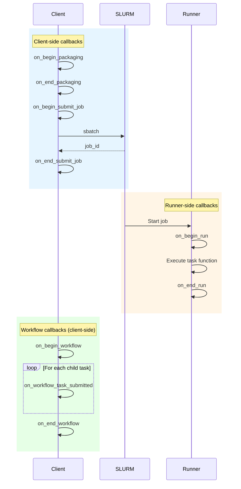

# Callbacks and Events

Callbacks let you observe packaging, submission, execution, and workflow events without changing task code.

## Lifecycle stages

- **Packaging begin/end**: Inspect container build and image resolution.
- **Submit begin/end**: Track job submission metadata and target paths.
- **Run begin/end**: Observe execution timing and outcomes.
- **Workflow begin/end**: Monitor workflow orchestration on the client side.
- **Workflow task submitted**: Capture dependency edges for graph visualization.

## Callback timeline

## Execution loci
Callbacks can be configured to run on the client or on the runner. The SDK checks `should_run_on_client` and `should_run_on_runner` to decide where each callback fires.

## Serialization rules
Callbacks that need to run on the runner are pickled and shipped alongside the job script. Lightweight logging callbacks typically run only on the client.

## Typical uses

- Structured logging and progress output.
- Dependency graph visualization.
- Custom metrics or telemetry hooks.
