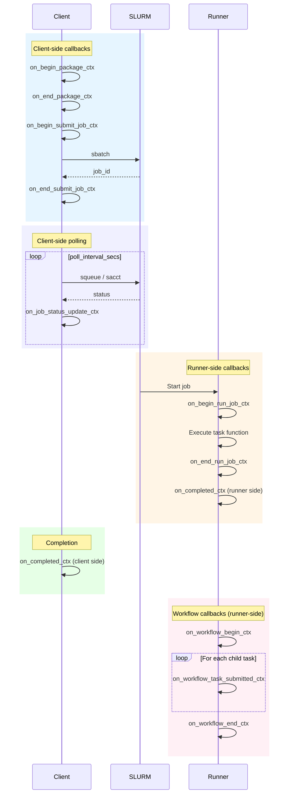

# Callbacks and Events

Callbacks let you observe packaging, submission, execution, and workflow events without changing task code. The SDK fires hooks at well-defined points in the job lifecycle, passing a typed context object that carries relevant metadata.

## Lifecycle stages

A single job passes through up to five stages, each with a begin/end hook pair:

- **Packaging** (`on_begin_package_ctx` / `on_end_package_ctx`): Fires on the client while the SDK builds or resolves the deployment artifact (wheel or container image).
- **Submission** (`on_begin_submit_job_ctx` / `on_end_submit_job_ctx`): Fires on the client immediately before and after the `sbatch` call.
- **Execution** (`on_begin_run_job_ctx` / `on_end_run_job_ctx`): Fires on the runner (compute node) around the user function invocation.
- **Status polling** (`on_job_status_update_ctx`): Fires on the client each time the SDK polls SLURM and observes a state change or the polling interval elapses.
- **Completion** (`on_completed_ctx`): Fires when a job reaches a terminal state. By default this runs on both client and runner.

Workflow orchestration adds three more hooks:

- **Workflow begin/end** (`on_workflow_begin_ctx` / `on_workflow_end_ctx`): Fires on the runner around the workflow orchestrator logic, after the workflow job itself has started.
- **Workflow task submitted** (`on_workflow_task_submitted_ctx`): Fires on the client each time the workflow submits a child task, enabling dependency-graph tracking.

## All hooks

The `BaseCallback` class defines 11 hooks. Each receives a single typed context argument:

| #   | Hook method                      | Context type                | Description                                          |
| --- | -------------------------------- | --------------------------- | ---------------------------------------------------- |
| 1   | `on_begin_package_ctx`           | `PackagingBeginContext`     | Packaging is about to start                          |
| 2   | `on_end_package_ctx`             | `PackagingEndContext`       | Packaging has completed                              |
| 3   | `on_begin_submit_job_ctx`        | `SubmitBeginContext`        | Job is about to be submitted via sbatch              |
| 4   | `on_end_submit_job_ctx`          | `SubmitEndContext`          | Job has been submitted; job ID is available          |
| 5   | `on_job_status_update_ctx`       | `JobStatusUpdatedContext`   | Polling detected a status change or interval elapsed |
| 6   | `on_begin_run_job_ctx`           | `RunBeginContext`           | Runner is about to invoke the user function          |
| 7   | `on_end_run_job_ctx`             | `RunEndContext`             | User function has returned or raised                 |
| 8   | `on_completed_ctx`               | `CompletedContext`          | Job reached a terminal SLURM state                   |
| 9   | `on_workflow_begin_ctx`          | `WorkflowCallbackContext`   | Workflow orchestrator is starting                    |
| 10  | `on_workflow_end_ctx`            | `WorkflowCallbackContext`   | Workflow orchestrator has finished                   |
| 11  | `on_workflow_task_submitted_ctx` | `WorkflowTaskSubmitContext` | Workflow submitted a child task                      |

## Callback timeline

The diagram below shows the order in which hooks fire for a single job submission, with an optional workflow layer:


```mermaid
sequenceDiagram
    participant Client
    participant SLURM
    participant Runner

    rect rgb(230, 245, 255)
        Note over Client: Client-side callbacks
        Client->>Client: on_begin_package_ctx
        Client->>Client: on_end_package_ctx
        Client->>Client: on_begin_submit_job_ctx
        Client->>SLURM: sbatch
        SLURM-->>Client: job_id
        Client->>Client: on_end_submit_job_ctx
    end

    rect rgb(240, 240, 255)
        Note over Client: Client-side polling
        loop poll_interval_secs
            Client->>SLURM: squeue / sacct
            SLURM-->>Client: status
            Client->>Client: on_job_status_update_ctx
        end
    end

    rect rgb(255, 245, 230)
        Note over Runner: Runner-side callbacks
        SLURM->>Runner: Start job
        Runner->>Runner: on_begin_run_job_ctx
        Runner->>Runner: Execute task function
        Runner->>Runner: on_end_run_job_ctx
        Runner->>Runner: on_completed_ctx (runner side)
    end

    rect rgb(230, 255, 230)
        Note over Client: Completion
        Client->>Client: on_completed_ctx (client side)
    end

    rect rgb(255, 240, 245)
        Note over Runner: Workflow callbacks (runner-side)
        Runner->>Runner: on_workflow_begin_ctx
        loop For each child task
            Runner->>Runner: on_workflow_task_submitted_ctx
        end
        Runner->>Runner: on_workflow_end_ctx
    end
```

## Execution loci

Every hook has a **default execution locus** that determines whether it fires on the client process, on the runner (compute node), or both. The SDK stores these defaults in `_DEFAULT_HOOK_LOCI`:

| Hook                             | Default locus | Context type                |
| -------------------------------- | ------------- | --------------------------- |
| `on_begin_package_ctx`           | `CLIENT`      | `PackagingBeginContext`     |
| `on_end_package_ctx`             | `CLIENT`      | `PackagingEndContext`       |
| `on_begin_submit_job_ctx`        | `CLIENT`      | `SubmitBeginContext`        |
| `on_end_submit_job_ctx`          | `CLIENT`      | `SubmitEndContext`          |
| `on_job_status_update_ctx`       | `CLIENT`      | `JobStatusUpdatedContext`   |
| `on_begin_run_job_ctx`           | `RUNNER`      | `RunBeginContext`           |
| `on_end_run_job_ctx`             | `RUNNER`      | `RunEndContext`             |
| `on_completed_ctx`               | `BOTH`        | `CompletedContext`          |
| `on_workflow_begin_ctx`          | `RUNNER`      | `WorkflowCallbackContext`   |
| `on_workflow_end_ctx`            | `RUNNER`      | `WorkflowCallbackContext`   |
| `on_workflow_task_submitted_ctx` | `CLIENT`      | `WorkflowTaskSubmitContext` |

The SDK calls `should_run_on_client(hook_name)` and `should_run_on_runner(hook_name)` to decide where each hook fires. For hooks with locus `BOTH`, the hook fires in both locations, and the `CompletedContext.emitted_by` field tells you which side emitted the current invocation.

### Overriding the default locus with `execution_loci`

You can override the default locus for any hook by setting the `execution_loci` dict on your callback subclass:

```python
class MyCallback(BaseCallback):
    execution_loci = {
        "on_completed_ctx": ExecutionLocus.CLIENT,  # only fire on client
    }
```

This is a per-hook override. Any hook not listed in the dict falls back to its default from `_DEFAULT_HOOK_LOCI`. If a hook is not in either dict, it defaults to `CLIENT`.

## `requires_pickling`

The `requires_pickling` class attribute controls whether the SDK serializes the callback and ships it to the runner alongside the job script. It defaults to `True`.

Set `requires_pickling = False` when your callback only needs client-side hooks (packaging, submission, polling). This avoids serialization failures for callbacks that hold unpicklable references such as open file handles, database connections, or Rich consoles.

When `requires_pickling` is `False`, runner-side hooks (`on_begin_run_job_ctx`, `on_end_run_job_ctx`, `on_workflow_begin_ctx`, `on_workflow_end_ctx`) will never fire for that callback because the callback object is not present on the compute node.

## `poll_interval_secs`

The `poll_interval_secs` class attribute controls SDK-managed status polling. When set to a positive number, the SDK spawns a background thread that periodically queries SLURM for the job's current state and fires `on_job_status_update_ctx` on each poll cycle.

```python
class ProgressCallback(BaseCallback):
    requires_pickling = False
    poll_interval_secs = 30.0  # check every 30 seconds
```

If `poll_interval_secs` is `None` (the default), no automatic polling occurs and `on_job_status_update_ctx` is never called.

The `JobStatusUpdatedContext` passed to the hook includes the current SLURM status dict, the previous state string, and a boolean `is_terminal` flag that is `True` when the job has reached a final state (COMPLETED, FAILED, CANCELLED, etc.).

## Serialization rules

Callbacks that need to run on the runner must survive pickling. The SDK serializes them into the job directory so the runner process can reconstruct them. The rules are:

1. **`requires_pickling = True` (default)**: The callback is pickled and sent to the runner. All runner-side hooks fire normally. If pickling fails, the SDK raises an error at submission time.
1. **`requires_pickling = False`**: The callback stays on the client only. Runner-side hooks are silently skipped. Client-side hooks (packaging, submission, polling, and the client side of `on_completed_ctx`) still fire.
1. **Hooks with locus `BOTH`**: Currently only `on_completed_ctx` defaults to `BOTH`. When `requires_pickling = False`, only the client-side invocation fires. When `requires_pickling = True`, the hook fires on both the runner (immediately after `on_end_run_job_ctx`) and on the client (when polling detects the terminal state).

The runner reconstructs callbacks from the pickled file, calls the runner-side hooks in order, and discards the callback objects when the job finishes. The client-side callback instances are the original objects held in memory by the submitting process.

## Custom callback example

Below is a complete `BaseCallback` subclass that logs timing information for packaging and submission on the client, without needing to be serialized to the runner:

```python
import logging
from slurm.callbacks import (
    BaseCallback,
    PackagingBeginContext,
    PackagingEndContext,
    SubmitEndContext,
    JobStatusUpdatedContext,
)

logger = logging.getLogger(__name__)


class TimingCallback(BaseCallback):
    """Logs wall-clock durations for packaging and submission."""

    requires_pickling = False
    poll_interval_secs = 60.0

    def on_begin_package_ctx(self, ctx: PackagingBeginContext) -> None:
        self._pack_start = ctx.timestamp
        logger.info("Packaging started for %s", ctx.task)

    def on_end_package_ctx(self, ctx: PackagingEndContext) -> None:
        duration = ctx.duration or (ctx.timestamp - self._pack_start)
        logger.info("Packaging finished in %.1fs", duration)

    def on_end_submit_job_ctx(self, ctx: SubmitEndContext) -> None:
        logger.info("Job %s submitted to %s", ctx.job_id, ctx.target_job_dir)

    def on_job_status_update_ctx(self, ctx: JobStatusUpdatedContext) -> None:
        state = ctx.status.get("job_state", "UNKNOWN")
        logger.info(
            "Job %s state: %s (terminal=%s)", ctx.job_id, state, ctx.is_terminal
        )
```

Register the callback when creating the cluster or submitting a job:

```python
cluster = Cluster.from_file("Slurmfile", callbacks=[TimingCallback()])
job = cluster.submit(my_task)
```

## Typical uses

- **Structured logging and progress output**: Use client-side hooks to print Rich progress bars or write structured log lines.
- **Dependency graph visualization**: Use `on_workflow_task_submitted_ctx` to capture parent-child edges and render a DAG.
- **Custom metrics and telemetry**: Fire metrics to Prometheus, Datadog, or MLflow from `on_end_run_job_ctx`.
- **Alerting on failure**: Check `RunEndContext.status` or `CompletedContext.job_state` and send notifications.
- **Benchmarking**: Measure end-to-end wall time from `on_begin_package_ctx` through `on_completed_ctx`.

## Further reading

- [Callbacks reference](../reference/api/callbacks.md) for the full API surface of `BaseCallback` and all context dataclasses.
- [How to create custom task and workflow decorators](../how-to/custom-task-decorators.md) for extending the SDK's decorator system.
