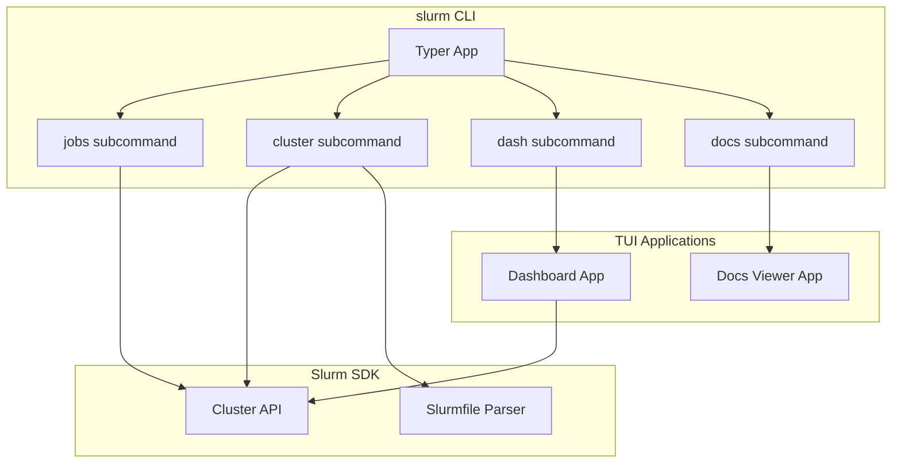
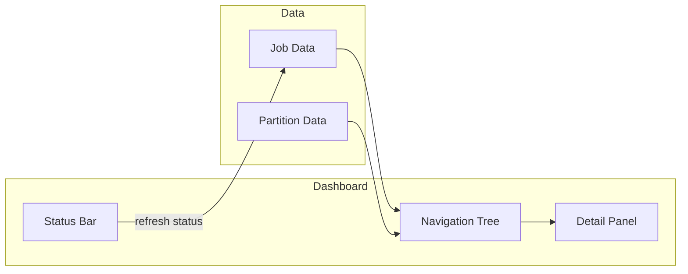
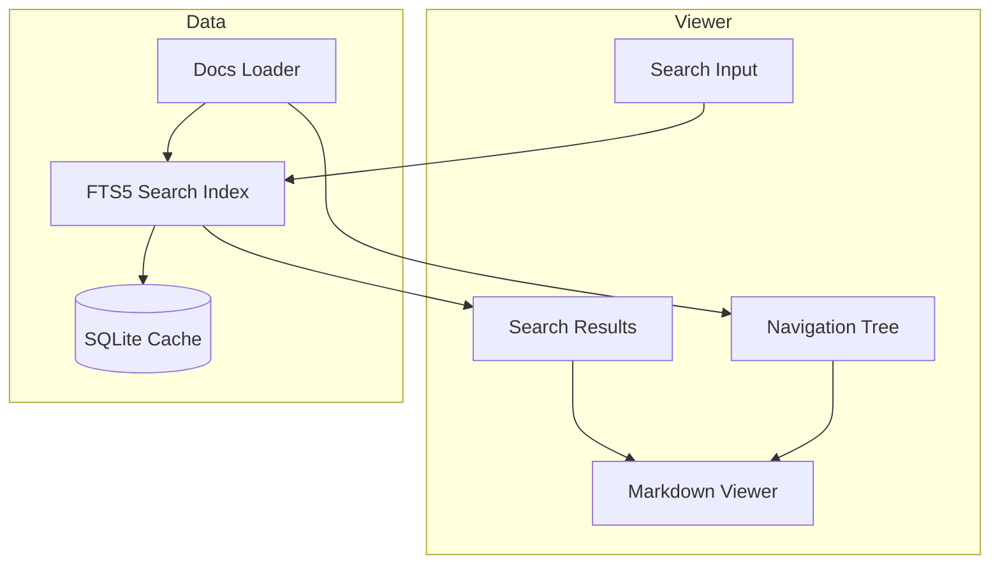
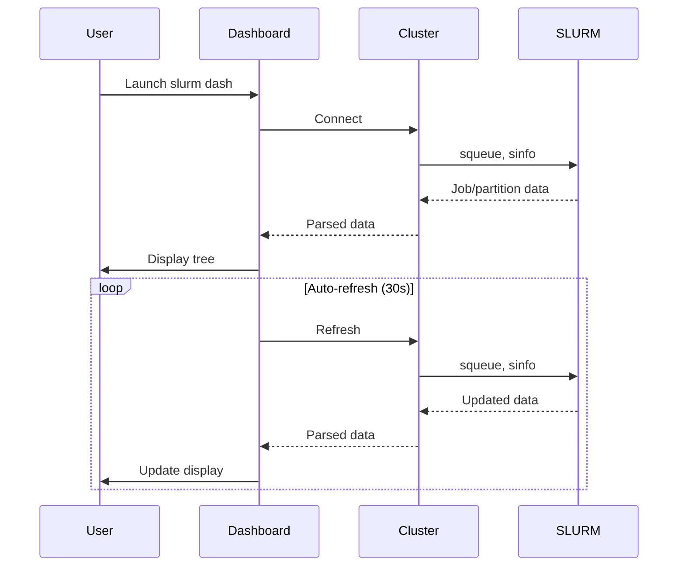
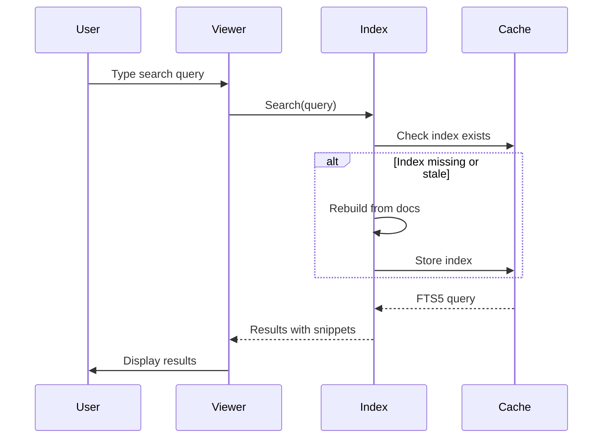

# CLI and TUI Architecture

This document explains the design decisions behind the `slurm` command-line interface and its interactive TUI applications.

## Overview

The CLI provides two modes of interaction:

1. **Command-line mode**: Traditional commands for scripting and quick queries (`slurm jobs list`, `slurm cluster show`)
1. **TUI mode**: Interactive terminal applications for monitoring and exploration (`slurm dash`, `slurm docs`)

Both modes share the same underlying SDK, ensuring consistent behavior whether you're scripting or working interactively.

## Design Principles

### Offline-First Where Possible

Some operations don't require cluster connectivity:

- `slurm cluster list` reads the Slurmfile locally
- `slurm docs` bundles documentation with the package

This enables working with the SDK even when disconnected from your cluster.

### Progressive Enhancement

The TUI features are optional dependencies. The base CLI works with just `pip install slurm-sdk`, while interactive features require `pip install slurm-sdk[tui]`.

This keeps the core package lightweight while allowing rich experiences for those who want them.

### Consistent Data Model

Both CLI commands and TUI applications use the same `Cluster` class to connect and query SLURM. This means:

- Job data looks the same in `slurm jobs list` and `slurm dash`
- Environment selection (`--env`) works identically everywhere
- Error messages follow the same patterns

## CLI Architecture

The CLI uses [Typer](https://typer.tiangolo.com/) for command parsing, which provides automatic help generation and shell completion.

## TUI Architecture

The TUI applications are built with [Textual](https://textual.textualize.io/), a modern Python framework for terminal user interfaces.

### Dashboard (`slurm dash`)

The dashboard provides real-time monitoring of jobs and cluster status.

**Key design decisions:**

- **Two-pane layout**: Mirrors familiar tools like `htop` and file managers
- **Hybrid refresh**: Auto-refresh when focused, manual refresh always available
- **Non-blocking data loading**: UI remains responsive during cluster queries

### Documentation Viewer (`slurm docs`)

The docs viewer provides offline access to SDK documentation with full-text search.

**Key design decisions:**

- **Bundled documentation**: Docs are packaged with the SDK for offline access
- **SQLite FTS5 search**: Fast full-text search with prefix matching and context snippets
- **Cached index**: Search index is built once and cached to disk
- **Hidden search bar**: Appears only when needed (`/` key), reducing visual noise

## Search Implementation

The documentation search uses SQLite's FTS5 (Full-Text Search) extension:

1. **Indexing**: On first use, all markdown files are parsed, stripped of formatting, and indexed
1. **Caching**: The index is stored in `~/.cache/slurm/docs_search.db`
1. **Invalidation**: A hash of all documentation content triggers re-indexing when docs change
1. **Query processing**: User queries are escaped and enhanced with prefix wildcards for partial matching

Prefix matching means typing "work" finds documents containing "workflow", "worker", and "working".

## Focus Management

TUI applications need careful focus management to feel natural:

- **Navigation tree**: Default focus for browsing
- **Search input**: Focused with `/`, hidden after selection
- **Search results**: Arrow keys move focus from search input to results
- **Content viewer**: Focused after selecting a document for reading

This flow mirrors web browser behavior: search, select, read.

## Data Flow

### Job Monitoring

### Documentation Search

## Error Handling

Both CLI and TUI follow consistent error handling:

- **Connection errors**: Clear message with hostname and suggested actions
- **Missing Slurmfile**: Instructions on how to create one
- **Unknown environment**: List of available environments
- **SLURM errors**: Pass through the underlying error with context

In TUI mode, errors appear as notifications that don't disrupt the interface.

## See Also

- [CLI Reference](../reference/cli.md) - Complete command reference
- [How to Use the CLI](../how-to/cli.md) - Step-by-step usage guide
- [System Overview](system_overview.md) - Overall SDK architecture
