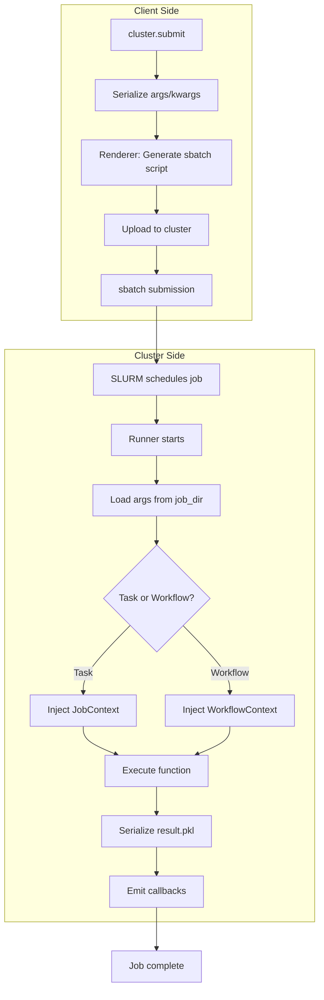

# Rendering and Runner

The renderer produces the sbatch script that configures the job environment, and the runner executes the target function inside the job.

## Execution Flow

## Rendering (`slurm.rendering`)

- Combines SBATCH directives, packaging setup commands, and runner invocation.
- Exports cluster metadata such as packaging config for nested workflow execution.
- Writes job artifacts into a per-job directory for logs and results.

## Runner (`slurm.runner`)

- Loads task arguments and keyword arguments from the job directory.
- Injects `JobContext` or `WorkflowContext` when requested.
- Executes the task and serializes results to disk.
- Emits callback events for workflow begin/end and job completion.

## Debugging tips

- Inspect the rendered sbatch script in the job directory when a job fails early.
- Check `slurm_*.out` and `slurm_*.err` for environment setup output.
- Validate that `CONTAINER_IMAGE` and `PY_EXEC` are set in the job output.
