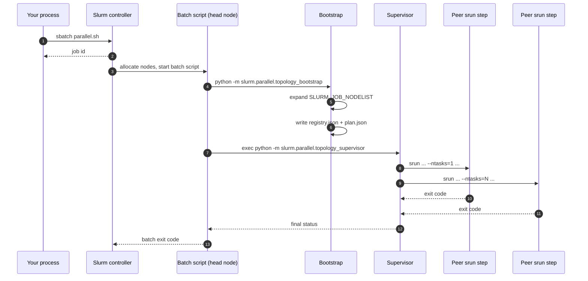
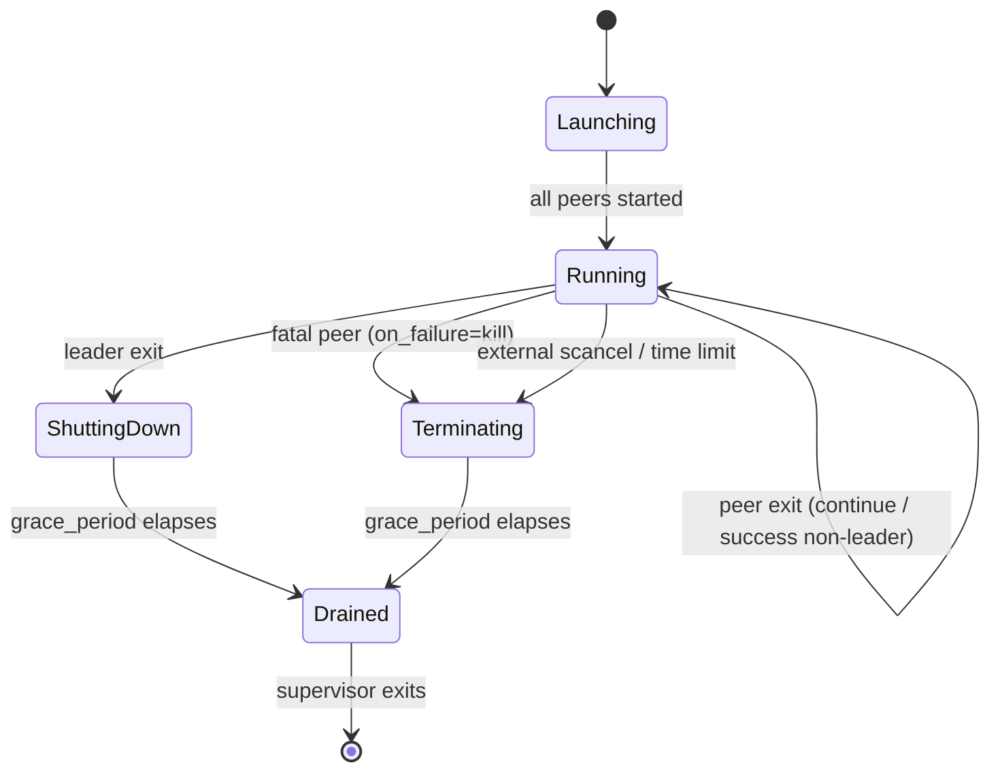

# How parallel allocations work

`parallel(...)` looks like a Python call but it reaches deep into Slurm. This
page explains what actually happens between `parallel(Peer(train), Peer(metrics))`
and the moment your first peer starts printing log lines. Understanding the
mechanics helps when you need to debug a stuck supervisor, interpret a job id,
or reason about why two peers share a node.

## One allocation, many steps

The SDK maps parallel workloads onto two stacked Slurm primitives:

- A **Slurm allocation** is one `sbatch` submission — a reservation of nodes
  for a bounded walltime. The allocation has one batch job id.
- A **job step** is one `srun` invocation inside the allocation. Steps can
  overlap if they target different CPUs / GPUs, and a single allocation can
  run many concurrent steps.

`parallel(...)` uses both. One `parallel(...)` call is always exactly one
allocation, sized from a single pool that fits every peer's resource claim.
Each `Peer` — whether singleton or replica set — becomes one job step
(`srun`) inside that allocation.

| SDK concept              | Slurm concept                     |
| ------------------------ | --------------------------------- |
| `parallel(...)` call     | One `sbatch` submission           |
| The pool                 | One `#SBATCH` resource request    |
| `Peer` (singleton)       | One `srun` step with `--ntasks=1` |
| `Peer.replicas(count=N)` | One `srun` step with `--ntasks=N` |
| `Peer(leader=True)`      | Step whose exit triggers shutdown |

Because every peer shares the same base job id, `squeue -j <id>` prints the
allocation and `sacct -j <id>` attributes step-level accounting back to it.

## Submission flow

The batch script does not contain your Python code. It does three things:
stage job state, run a one-shot bootstrap, and hand control to a long-lived
supervisor. Every peer is launched by that supervisor — not by the batch
script — which is what makes per-peer failure policies possible.



The bootstrap is a short Python program that runs once, on the batch head
node, before any peer launches. Its job is to seed shared state:

- Expands the allocation's nodelist via `scontrol show hostnames`.
- Writes `$JOB_DIR/registry.json` with one entry per peer replica. Pool and
  hostname list are recorded up front; peers start with `hostname=""` and
  `state="pending"`. Each peer's runner publishes its actual hostname and
  `SLURM_STEP_ID` at startup (see "What the registry actually contains"
  below).
- Serialises per-peer argument pickles so the runner can deserialise
  positional and keyword args when the step starts.
- Writes `$JOB_DIR/plan.json` — a static snapshot of every `srun` command
  line and failure policy. The supervisor executes from the plan; it never
  re-examines the spec.

Once the plan exists, the batch script `exec`s into the supervisor. The
supervisor owns everything that happens from there: launching steps, applying
failure policies, propagating shutdown signals, updating the registry.

## Why one allocation instead of one `sbatch` per peer?

A naive alternative is "submit one `sbatch` per peer, then stitch them
together." That approach breaks three guarantees `parallel(...)` relies on:

- **Atomic start.** Slurm schedules the allocation as a unit. With
  independent submissions, an RL training run could start the learner while
  the workers are still queued — peers would race against an empty registry
  and the learner would burn expensive node-hours waiting.
- **Single job id.** Cancellation, accounting, and dependency tracking
  (`afterok:<id>`) all work against one id. Multiple allocations fragment
  this surface and force userspace plumbing.
- **Service discovery.** The bootstrap builds one `registry.json` that every
  peer reads. With separate allocations, the SDK would have to ship a
  side-channel (shared filesystem locks, a coordination server) to reach
  parity.

The SDK never submits multiple allocations for a single `parallel(...)` call.

## Supervisor lifecycle

The supervisor is a plain Python process. It launches each step with
`subprocess.Popen(["srun", ...])`, watches PIDs with a `select` loop, updates
the registry when steps exit, and applies the failure policy from the plan.
It also installs a `SIGTERM` handler so an external `scancel` propagates into
the same shutdown path that a leader exit takes.



The three terminal paths from `Running` differ only in intent:

- **`ShuttingDown`** — a `leader=True` peer exited (success or failure). The
  supervisor writes `state="shutting_down"` for every remaining peer, sends
  `SIGTERM` through `scancel --signal=TERM` to every step, waits
  `grace_period_seconds`, then hard-cancels stragglers. Helpers whose
  `on_failure="continue"` are reported as `shutdown_by_leader` in
  `peer_outcomes()` — not `fatal`.
- **`Terminating`** — a peer with `on_failure="kill"` failed. Same mechanics
  as shutdown, but the overall job exit code is non-zero and `get_results()`
  raises `CompositeJobError`.
- **`Running → Drained`** without intermediate shutdown — every non-leader
  peer has succeeded and there is no leader. This is the symmetric-peer
  default: every peer is load-bearing, they all exit cleanly, the supervisor
  collects results and exits.

A peer's failure policy is exactly one of two values. `kill` (the default)
makes any failure fatal to the allocation; `continue` tolerates the failure
and surfaces it through `peer_outcomes()` while the rest of the job proceeds.

## Why `scancel --signal=TERM` instead of `kill`?

A bash `kill` in the batch script targets the local `srun` wrapper, not the
remote process running on the compute node. The wrapper eventually notices
its child disappeared and cleans up, but the peer process itself sees no
signal. `scancel --signal=TERM <jobid>.<stepid>` asks Slurm to propagate the
signal through its step daemons, which delivers it to the remote process
group directly. That is what lets a peer handle `SIGTERM`, flush state, and
exit within the grace window.

The same mechanism is why `ctx.shutdown_requested` works at all. The runner
installs a `SIGTERM` handler that flips a thread-safe flag; pure-Python
sidecars poll it (`while not ctx.shutdown_requested:`) and subprocess-based
sidecars (`tensorboard`, `node-exporter`) inherit the signal through their
process group.

## What the registry actually contains

`$JOB_DIR/registry.json` is the system of record for the allocation.
Bootstrap seeds the skeleton; each peer's runner publishes its actual
hostname and step id at startup (via `update_peer_hostinfo`); the supervisor
writes terminal outcomes; user code reads the whole thing through
`ctx.peers`. Every write goes through `write_tmp + rename` for atomicity, and
every read-modify-write takes an `fcntl.flock` on `<registry>.lock` so
concurrent `announce()` calls from different peers can't overwrite each
other's fields.

The registry's authoritative section is `peers`, which owns runtime placement
and state: hostname, step id, metadata, and outcomes.

A minimal registry for a two-peer job looks roughly like:

```json
{
  "peers": {
    "train":   [{"state": "ready", "hostname": "gpu-07", "step_id": "12345.0", ...}],
    "metrics": [{"state": "ready", "hostname": "gpu-07", "step_id": "12345.1", ...}]
  }
}
```

Readers cache the deserialised snapshot. `ctx.peers["train"].refresh()` re-
reads the file on demand — useful when waiting for a peer that hasn't
announced yet. `PeerGroup.wait_all(...)` encapsulates the poll loop:
`hostname` and `step_id` are treated as top-level runtime fields, while any
other key name waits on announced `metadata`.

## How local mode fakes all of this

When `Cluster(backend_type="local")` runs a `parallel(...)` submission on a
workstation without `sbatch` in the `PATH`, the SDK takes a dedicated prep
path instead of trying to execute part of the rendered batch script. It still
renders the full script for inspection, but local mode separately
materialises the shared artifacts (`plan.json`, per-peer arg pickles), runs
packaging setup, invokes the bootstrap directly, and then launches the
supervisor via `subprocess.Popen`. Peers launch as plain child processes — no
`srun`, no step ids — but the supervisor state machine, the registry, the
failure policies, and `ctx.peers` all behave identically. `scancel` is
replaced by sending `SIGTERM` to the process group.

This lets you run a scaled-down `parallel(...)` job end-to-end on a laptop
before you commit a long allocation on a real cluster. See the
[local-mode capacity validation](../CHANGELOG.md) entry for what the SDK
checks before launch.

## Where to look next

- The [parallel reference](../reference/parallel.md) lists every type and its
  full docstring.
- [Slurm Concepts](slurm_concepts.md) covers the underlying allocation / step
  vocabulary if the terms above are new.
- [Rendering and Runner](rendering_and_runner.md) explains the batch-script
  generation pipeline that `parallel(...)` extends.
