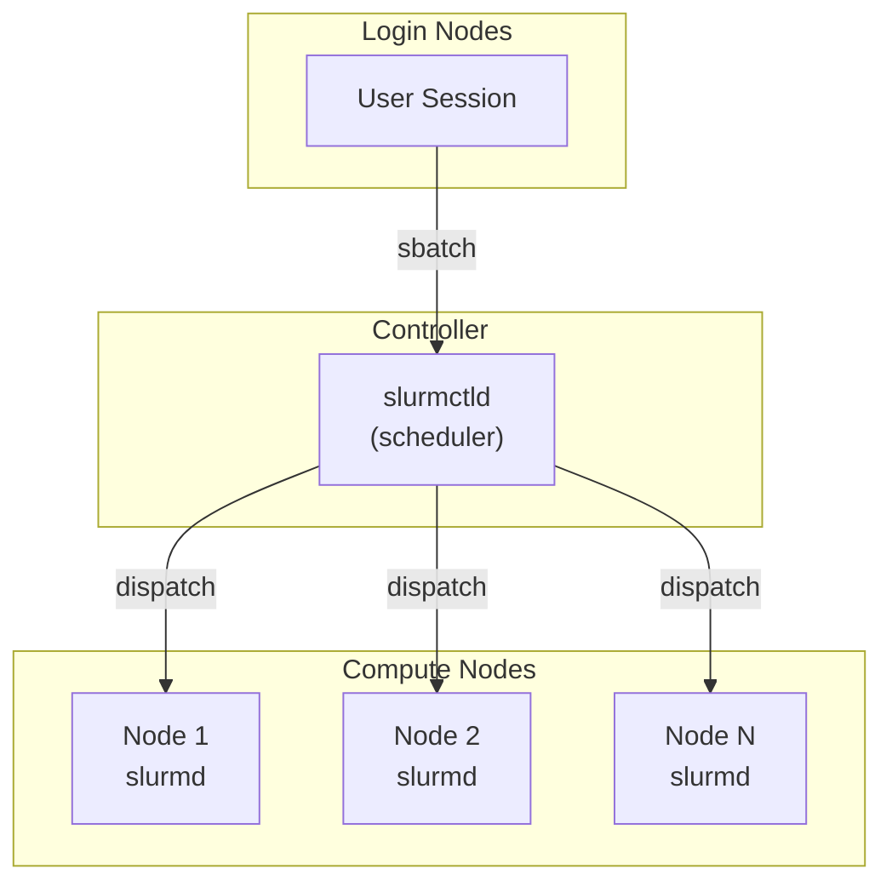
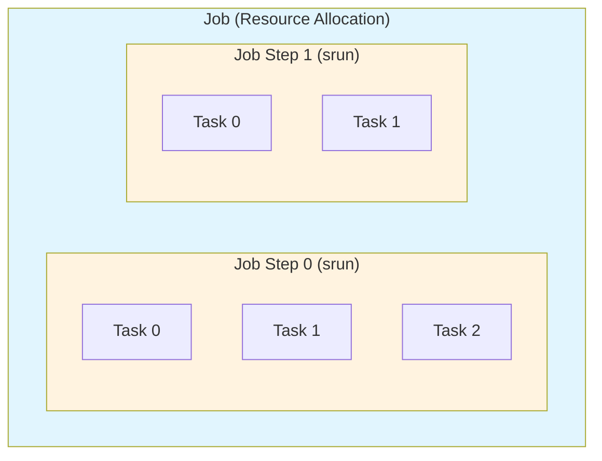
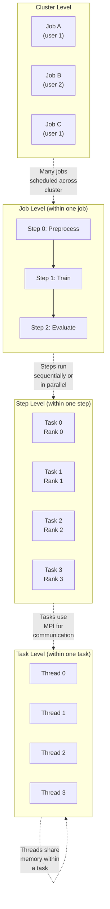
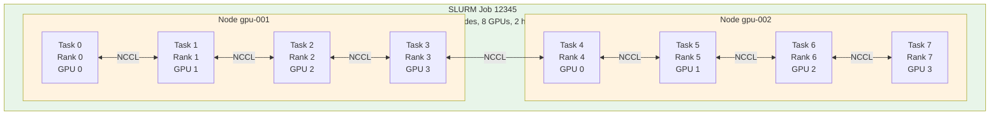
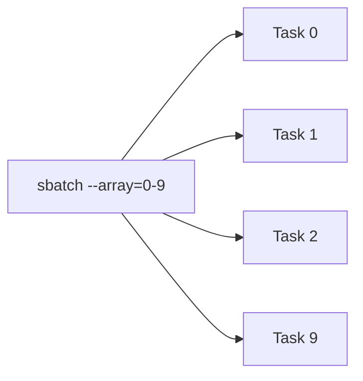

# Slurm Concepts

This page introduces key Slurm concepts for users who are new to HPC job scheduling. Understanding these fundamentals will help you use Slurm SDK more effectively.

## What is Slurm?

Slurm (Simple Linux Utility for Resource Management) is an open-source workload manager used on most of the world's supercomputers and HPC clusters. It handles:

- **Job scheduling**: Deciding when and where jobs run
- **Resource allocation**: Assigning CPUs, memory, GPUs to jobs
- **Queue management**: Prioritizing jobs from multiple users
- **Job monitoring**: Tracking job status and resource usage

## Key Concepts

### Cluster Architecture



- **Login nodes**: Where you connect via SSH and submit jobs
- **Controller**: The `slurmctld` daemon that schedules jobs
- **Compute nodes**: Where jobs actually run, each running `slurmd`

### Partitions

A **partition** is a logical grouping of compute nodes with shared properties. Think of it as a queue with specific characteristics:

```bash
# Example partitions
debug     # Small jobs, quick turnaround, short time limits
batch     # Standard production jobs
gpu       # Nodes with GPUs
highmem   # Nodes with large memory
```

In Slurm SDK, you specify the partition when creating a cluster connection:

```python
cluster = Cluster(
    backend_type="ssh",
    hostname="login.hpc.example.com",
    partition="gpu"  # Jobs will run on GPU partition
)
```

### Jobs, Job Steps, and Tasks

SLURM has a three-level hierarchy for organizing work. Understanding this hierarchy is essential for writing efficient HPC applications.



#### Job

A **job** is a resource allocation—a reservation of compute resources (nodes, CPUs, memory, GPUs) for a period of time. When you submit a batch script with `sbatch`, SLURM creates a job and allocates resources once they become available.

Key characteristics:

- A job reserves resources but doesn't necessarily use them all immediately
- Resources remain allocated for the job's entire duration (or until it exits)
- A single job can contain multiple sequential or parallel job steps
- Jobs are identified by a unique `SLURM_JOB_ID`

#### Job Step

A **job step** is a unit of work within a job, created with `srun`. Job steps define how work is distributed across the allocated resources.

Key characteristics:

- Created with `srun` command (either in scripts or interactively)
- Can use all or a subset of the job's allocated resources
- Multiple job steps can run sequentially or in parallel within a job
- Each step has its own `SLURM_STEP_ID` (0, 1, 2, ...)

#### Task

A **task** is a single process within a job step. When you run `srun --ntasks=4 ./program`, SLURM launches 4 tasks (4 copies of your program) that can run in parallel.

Key characteristics:

- Each task is an OS process with its own memory space
- Tasks within a step can communicate via MPI
- Each task has a unique `SLURM_PROCID` (0 to ntasks-1)
- Tasks can be distributed across multiple nodes

### The Concurrency Model

SLURM provides parallelism at multiple levels. Understanding when to use each level is key to efficient resource utilization.



#### Level 1: Multiple Jobs (Cluster-Wide Parallelism)

Multiple jobs from one or many users run concurrently across the cluster. Each job has independent resource allocations.

**When to use**: Independent workloads that don't need to communicate.

```python
# SDK: Submit independent jobs
job1 = train_model(dataset="cifar10")
job2 = train_model(dataset="mnist")
job3 = train_model(dataset="imagenet")
# All three jobs can run in parallel on different nodes
```

#### Level 2: Job Steps (Within-Job Parallelism)

Multiple job steps within a single job can run sequentially or in parallel, sharing the job's resource allocation.

**When to use**: Multi-phase workflows where phases have different resource needs, or when you want parallel tasks that share a common allocation.

```bash
#!/bin/bash
#SBATCH --nodes=4
#SBATCH --time=02:00:00

# Sequential steps (one after another)
srun --nodes=1 ./preprocess.sh      # Step 0: uses 1 node
srun --nodes=4 ./train.sh           # Step 1: uses all 4 nodes
srun --nodes=1 ./evaluate.sh        # Step 2: uses 1 node

# Parallel steps (run simultaneously, backgrounded)
srun --nodes=2 ./task_a.sh &        # Step 3: uses nodes 0-1
srun --nodes=2 ./task_b.sh &        # Step 4: uses nodes 2-3
wait                                 # Wait for both to complete
```

#### Level 3: Tasks (MPI-Style Parallelism)

Multiple tasks within a job step run in parallel, typically communicating via MPI.

**When to use**: Tightly-coupled parallel applications (simulations, distributed training with data parallelism).

```bash
# Launch 8 MPI tasks across 2 nodes
srun --nodes=2 --ntasks=8 ./mpi_program
```

Each task gets:

- `SLURM_PROCID`: Global task rank (0-7)
- `SLURM_LOCALID`: Local rank on its node (0-3 on each node)
- `SLURM_NODEID`: Which node it's on (0 or 1)

#### Level 4: Threads (Shared-Memory Parallelism)

Multiple threads within a single task share memory and run on CPUs allocated to that task.

**When to use**: OpenMP, multi-threaded libraries, or Python multiprocessing within a task.

```bash
#SBATCH --ntasks=2
#SBATCH --cpus-per-task=8

# Each of 2 tasks gets 8 CPUs for threading
export OMP_NUM_THREADS=8
srun ./threaded_program
```

### Choosing the Right Parallelism Level

| Scenario                      | Recommended Level         | Why                                    |
| ----------------------------- | ------------------------- | -------------------------------------- |
| Parameter sweep (100 configs) | Array job (multiple jobs) | Independent runs, easy fault isolation |
| Multi-stage pipeline          | Job steps                 | Shared allocation, sequential phases   |
| Distributed deep learning     | Tasks (multi-node)        | Tight communication via NCCL/MPI       |
| Single-node data processing   | Threads                   | Shared memory, low overhead            |
| Hyperparameter search         | Array job or workflows    | Independence between trials            |

### How SDK Concepts Map to SLURM

The Slurm SDK introduces its own abstractions that map to native SLURM concepts:

| SDK Concept       | SLURM Concept                   | Description                                            |
| ----------------- | ------------------------------- | ------------------------------------------------------ |
| `@task` decorator | Job                             | Each decorated function submission creates a SLURM job |
| `@task.map()`     | Array Job                       | Maps inputs to array job tasks                         |
| `@workflow`       | Multiple Jobs with Dependencies | Orchestrates jobs with `--dependency` flags            |
| Cluster context   | Resource defaults               | Sets partition, account, and connection details        |

**Important distinction**: The SDK's `@task` decorator creates a SLURM **job**, not a SLURM task. This naming reflects the user's perspective (a task to accomplish) rather than SLURM's internal terminology.

```python
# SDK @task creates a SLURM job
@task(time="00:10:00", mem="4G", cpus_per_task=2)
def process_data(input_file: str) -> dict:
    # This function runs as a SLURM job
    # The job has 1 job step with 1 task using 2 CPUs
    return {"result": "processed"}
```

For multi-task parallelism within a single job, use the `ntasks` parameter:

```python
@task(
    time="01:00:00",
    nodes=2,
    ntasks=8,           # 8 SLURM tasks (MPI ranks)
    cpus_per_task=4,    # Each task gets 4 CPUs for threading
    gpus_per_task=1     # Each task gets 1 GPU
)
def distributed_train(config: dict) -> dict:
    # This creates 1 job with 8 tasks across 2 nodes
    # Use torch.distributed or MPI for inter-task communication
    return {"model": "trained"}
```

### Visualizing a Complete Example

Here's how a typical distributed training job maps to SLURM's hierarchy:



The corresponding SDK code:

```python
@task(
    nodes=2,
    ntasks_per_node=4,
    gpus_per_node=4,
    cpus_per_task=8,
    time="02:00:00"
)
def train_distributed(config: dict) -> dict:
    import torch.distributed as dist

    # SLURM sets these automatically
    rank = int(os.environ["SLURM_PROCID"])        # 0-7
    local_rank = int(os.environ["SLURM_LOCALID"]) # 0-3
    world_size = int(os.environ["SLURM_NTASKS"])  # 8

    dist.init_process_group(backend="nccl")
    # ... training code ...
    return {"loss": final_loss}
```

### Resource Specifications

Every job requests specific resources:

| Resource   | Slurm Flag        | SDK Parameter   | Description                 |
| ---------- | ----------------- | --------------- | --------------------------- |
| Time limit | `--time`          | `time`          | Maximum run time (HH:MM:SS) |
| Memory     | `--mem`           | `mem`           | Memory per node             |
| CPUs       | `--cpus-per-task` | `cpus_per_task` | CPU cores per task          |
| GPUs       | `--gpus`          | `gpus`          | Number of GPUs              |
| Nodes      | `--nodes`         | `nodes`         | Number of nodes             |

Example with multiple resources:

```python
@task(
    time="01:00:00",      # 1 hour limit
    mem="32G",            # 32 GB memory
    cpus_per_task=8,      # 8 CPU cores
    gpus=1                # 1 GPU
)
def train_model(data_path: str) -> dict:
    # Runs with allocated resources
    pass
```

### Array Jobs

**Array jobs** run the same script multiple times with different indices. They're efficient for parameter sweeps or processing multiple files:



Each task gets a unique `SLURM_ARRAY_TASK_ID` environment variable.

In Slurm SDK, use `.map()` to create array jobs:

```python
@task(time="00:05:00", mem="2G")
def process_chunk(chunk_id: int, data: str) -> dict:
    return {"chunk": chunk_id, "processed": True}

# Creates a Slurm array job with 10 tasks
chunks = [{"chunk_id": i, "data": f"data_{i}"} for i in range(10)]
array_job = process_chunk.map(chunks)
```

### Job Dependencies

Jobs can depend on other jobs completing successfully:


Native Slurm uses `--dependency=afterok:123` to express this.

In Slurm SDK, use `.after()` for dependencies:

```python
prep_job = preprocess(data)
train_job = train_model.after(prep_job)(model_config)
eval_job = evaluate.after(train_job)(metrics)
```

The SDK automatically manages the `--dependency` flags.

### Job States

Jobs move through various states:

| State     | Code | Description           |
| --------- | ---- | --------------------- |
| Pending   | `PD` | Waiting for resources |
| Running   | `R`  | Currently executing   |
| Completed | `CD` | Finished successfully |
| Failed    | `F`  | Exited with error     |
| Cancelled | `CA` | Cancelled by user     |
| Timeout   | `TO` | Exceeded time limit   |

## Common Slurm Commands

While Slurm SDK abstracts these, knowing them helps with debugging:

| Command   | Purpose               | Example           |
| --------- | --------------------- | ----------------- |
| `sbatch`  | Submit a batch script | `sbatch job.sh`   |
| `squeue`  | View job queue        | `squeue -u $USER` |
| `scancel` | Cancel a job          | `scancel 12345`   |
| `sinfo`   | View cluster status   | `sinfo -p gpu`    |
| `sacct`   | View job history      | `sacct -j 12345`  |

## How Slurm SDK Maps to Native Slurm

When you submit a task with Slurm SDK, here's what happens:

1. **Your Python code**:

   ```python
   @task(time="00:10:00", mem="4G", partition="gpu")
   def train(lr: float) -> dict:
       return {"accuracy": 0.95}

   with Cluster(backend_type="ssh", hostname="login.hpc.example.com") as cluster:
       job = train(lr=0.001)
   ```

1. **Generated sbatch script**:

   ```bash
   #!/bin/bash
   #SBATCH --time=00:10:00
   #SBATCH --mem=4G
   #SBATCH --partition=gpu
   #SBATCH --output=slurm-%j.out

   python -m slurm.runner \
       --task train \
       --args '{"lr": 0.001}'
   ```

1. **Slurm allocates resources and runs the script**

1. **Results are serialized and returned to your session**

## Environment Variables

Inside a running Slurm job, these environment variables are available:

| Variable              | Description                       |
| --------------------- | --------------------------------- |
| `SLURM_JOB_ID`        | Unique job identifier             |
| `SLURM_JOB_NAME`      | Name of the job                   |
| `SLURM_NODELIST`      | Nodes allocated to the job        |
| `SLURM_NTASKS`        | Number of tasks                   |
| `SLURM_CPUS_PER_TASK` | CPUs per task                     |
| `SLURM_ARRAY_TASK_ID` | Array task index (for array jobs) |
| `SLURM_ARRAY_JOB_ID`  | Array job ID (for array jobs)     |

## Further Reading

- [Official Slurm Documentation](https://slurm.schedmd.com/documentation.html)
- [Slurm Quick Start Guide](https://slurm.schedmd.com/quickstart.html)
- [sbatch Manual](https://slurm.schedmd.com/sbatch.html)
- [Slurm Tutorials](https://slurm.schedmd.com/tutorials.html)
