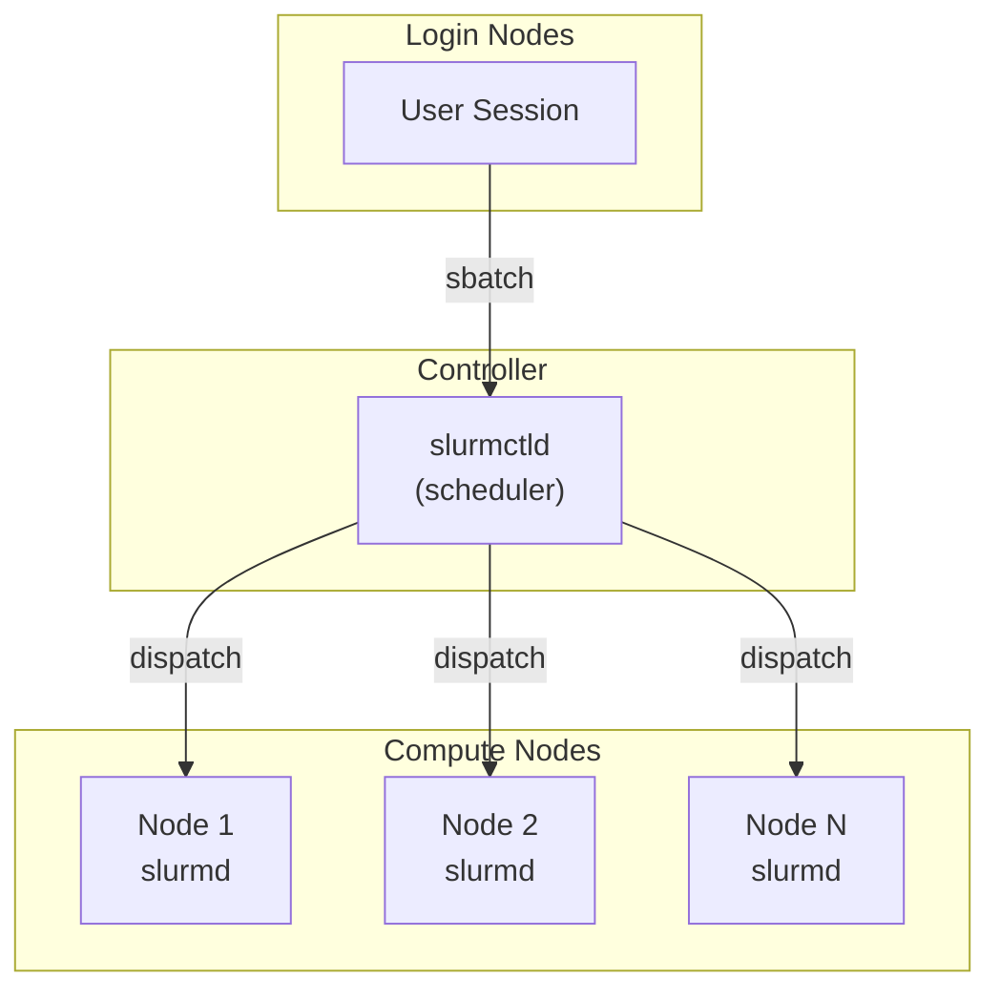
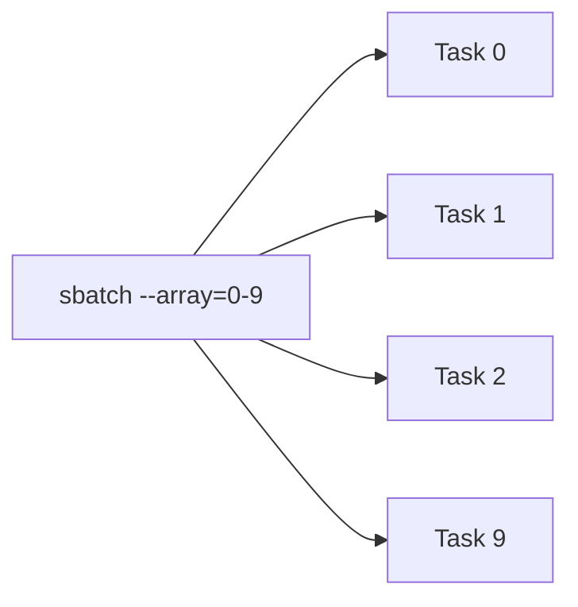
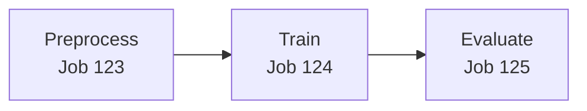

# Slurm Concepts

This page introduces key Slurm concepts for users who are new to HPC job scheduling. Understanding these fundamentals will help you use Slurm SDK more effectively.

## What is Slurm?

Slurm (Simple Linux Utility for Resource Management) is an open-source workload manager used on most of the world's supercomputers and HPC clusters. It handles:

- **Job scheduling**: Deciding when and where jobs run
- **Resource allocation**: Assigning CPUs, memory, GPUs to jobs
- **Queue management**: Prioritizing jobs from multiple users
- **Job monitoring**: Tracking job status and resource usage

## Key Concepts

### Cluster Architecture



- **Login nodes**: Where you connect via SSH and submit jobs
- **Controller**: The `slurmctld` daemon that schedules jobs
- **Compute nodes**: Where jobs actually run, each running `slurmd`

### Partitions

A **partition** is a logical grouping of compute nodes with shared properties. Think of it as a queue with specific characteristics:

```bash
# Example partitions
debug     # Small jobs, quick turnaround, short time limits
batch     # Standard production jobs
gpu       # Nodes with GPUs
highmem   # Nodes with large memory
```

In Slurm SDK, you specify the partition when creating a cluster connection:

```python
cluster = Cluster(
    backend_type="ssh",
    hostname="login.hpc.example.com",
    partition="gpu"  # Jobs will run on GPU partition
)
```

### Jobs and Tasks

- **Job**: A resource allocation request submitted to Slurm
- **Job step**: A set of tasks within a job (created with `srun`)
- **Task**: A single process within a job step

When you use `@task` in Slurm SDK, it creates a Slurm job:

```python
@task(time="00:10:00", mem="4G", cpus_per_task=2)
def process_data(input_file: str) -> dict:
    # This function runs as a Slurm job
    return {"result": "processed"}
```

### Resource Specifications

Every job requests specific resources:

| Resource   | Slurm Flag        | SDK Parameter   | Description                 |
| ---------- | ----------------- | --------------- | --------------------------- |
| Time limit | `--time`          | `time`          | Maximum run time (HH:MM:SS) |
| Memory     | `--mem`           | `mem`           | Memory per node             |
| CPUs       | `--cpus-per-task` | `cpus_per_task` | CPU cores per task          |
| GPUs       | `--gpus`          | `gpus`          | Number of GPUs              |
| Nodes      | `--nodes`         | `nodes`         | Number of nodes             |

Example with multiple resources:

```python
@task(
    time="01:00:00",      # 1 hour limit
    mem="32G",            # 32 GB memory
    cpus_per_task=8,      # 8 CPU cores
    gpus=1                # 1 GPU
)
def train_model(data_path: str) -> dict:
    # Runs with allocated resources
    pass
```

### Array Jobs

**Array jobs** run the same script multiple times with different indices. They're efficient for parameter sweeps or processing multiple files:



Each task gets a unique `SLURM_ARRAY_TASK_ID` environment variable.

In Slurm SDK, use `.map()` to create array jobs:

```python
@task(time="00:05:00", mem="2G")
def process_chunk(chunk_id: int, data: str) -> dict:
    return {"chunk": chunk_id, "processed": True}

# Creates a Slurm array job with 10 tasks
chunks = [{"chunk_id": i, "data": f"data_{i}"} for i in range(10)]
array_job = process_chunk.map(chunks)
```

### Job Dependencies

Jobs can depend on other jobs completing successfully:



Native Slurm uses `--dependency=afterok:123` to express this.

In Slurm SDK, use `.after()` for dependencies:

```python
prep_job = preprocess(data)
train_job = train_model.after(prep_job)(model_config)
eval_job = evaluate.after(train_job)(metrics)
```

The SDK automatically manages the `--dependency` flags.

### Job States

Jobs move through various states:

| State     | Code | Description           |
| --------- | ---- | --------------------- |
| Pending   | `PD` | Waiting for resources |
| Running   | `R`  | Currently executing   |
| Completed | `CD` | Finished successfully |
| Failed    | `F`  | Exited with error     |
| Cancelled | `CA` | Cancelled by user     |
| Timeout   | `TO` | Exceeded time limit   |

## Common Slurm Commands

While Slurm SDK abstracts these, knowing them helps with debugging:

| Command   | Purpose               | Example           |
| --------- | --------------------- | ----------------- |
| `sbatch`  | Submit a batch script | `sbatch job.sh`   |
| `squeue`  | View job queue        | `squeue -u $USER` |
| `scancel` | Cancel a job          | `scancel 12345`   |
| `sinfo`   | View cluster status   | `sinfo -p gpu`    |
| `sacct`   | View job history      | `sacct -j 12345`  |

## How Slurm SDK Maps to Native Slurm

When you submit a task with Slurm SDK, here's what happens:

1. **Your Python code**:

   ```python
   @task(time="00:10:00", mem="4G", partition="gpu")
   def train(lr: float) -> dict:
       return {"accuracy": 0.95}

   with Cluster(backend_type="ssh", hostname="login.hpc.example.com") as cluster:
       job = train(lr=0.001)
   ```

1. **Generated sbatch script**:

   ```bash
   #!/bin/bash
   #SBATCH --time=00:10:00
   #SBATCH --mem=4G
   #SBATCH --partition=gpu
   #SBATCH --output=slurm-%j.out

   python -m slurm.runner \
       --task train \
       --args '{"lr": 0.001}'
   ```

1. **Slurm allocates resources and runs the script**

1. **Results are serialized and returned to your session**

## Environment Variables

Inside a running Slurm job, these environment variables are available:

| Variable              | Description                       |
| --------------------- | --------------------------------- |
| `SLURM_JOB_ID`        | Unique job identifier             |
| `SLURM_JOB_NAME`      | Name of the job                   |
| `SLURM_NODELIST`      | Nodes allocated to the job        |
| `SLURM_NTASKS`        | Number of tasks                   |
| `SLURM_CPUS_PER_TASK` | CPUs per task                     |
| `SLURM_ARRAY_TASK_ID` | Array task index (for array jobs) |
| `SLURM_ARRAY_JOB_ID`  | Array job ID (for array jobs)     |

## Further Reading

- [Official Slurm Documentation](https://slurm.schedmd.com/documentation.html)
- [Slurm Quick Start Guide](https://slurm.schedmd.com/quickstart.html)
- [sbatch Manual](https://slurm.schedmd.com/sbatch.html)
- [Slurm Tutorials](https://slurm.schedmd.com/tutorials.html)
