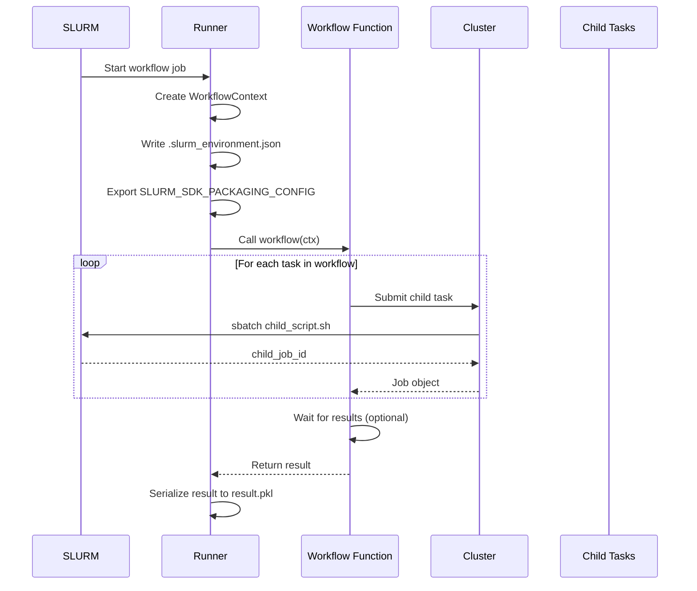

# Workflow Execution

Workflows are Python functions decorated with `@workflow`. They orchestrate multiple tasks and can submit additional jobs while running on the cluster.

## Key pieces

- **WorkflowContext**: Injected automatically into workflow functions. It provides a `cluster` instance, the workflow job directory, and a shared directory for artifacts.
- **Nested submissions**: Tasks invoked inside a workflow submit new jobs using the same cluster configuration.
- **Packaging inheritance**: Child tasks reuse the parent container image when possible, so they do not rebuild images mid-workflow.

## What happens at runtime



Step by step:

1. The workflow job starts and the runner creates a `WorkflowContext`.
1. Environment metadata is written into the workflow job directory (`.slurm_environment.json`).
1. `SLURM_SDK_PACKAGING_CONFIG` is exported so child submissions inherit the container image.
1. Child tasks write their outputs under `workflow_job_dir/tasks/<task-name>/<timestamp>/`.

## Directory structure

Workflow jobs create a nested directory structure for organizing outputs:

```text
workflow_job_dir/
├── result.pkl              # Workflow return value
├── metadata.json           # Job metadata
├── .slurm_environment.json # Environment config for child tasks
├── slurm_<jobid>.out       # Workflow stdout
├── slurm_<jobid>.err       # Workflow stderr
├── shared/                 # Shared artifacts between tasks
│   └── (user files)
└── tasks/                  # Child task outputs
    ├── process_data/
    │   └── 20240115_120000_abc123/
    │       ├── result.pkl
    │       ├── slurm_*.out
    │       └── slurm_*.err
    └── train_model/
        └── 20240115_120500_def456/
            ├── result.pkl
            ├── slurm_*.out
            └── slurm_*.err
```

## Error handling

- If cluster initialization fails inside the workflow, task submission is blocked early with a clear error.
- The workflow job still captures stdout/stderr in the usual job directory.

## Tips

- Keep workflow orchestration lightweight; heavy computation should live in task functions.
- Use the shared directory to pass large artifacts between tasks.
- Attach callbacks to observe workflow-level events and dependency graphs.
