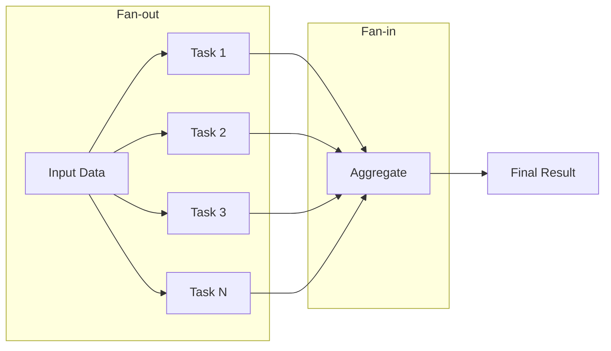
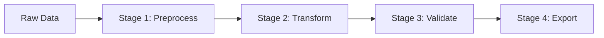
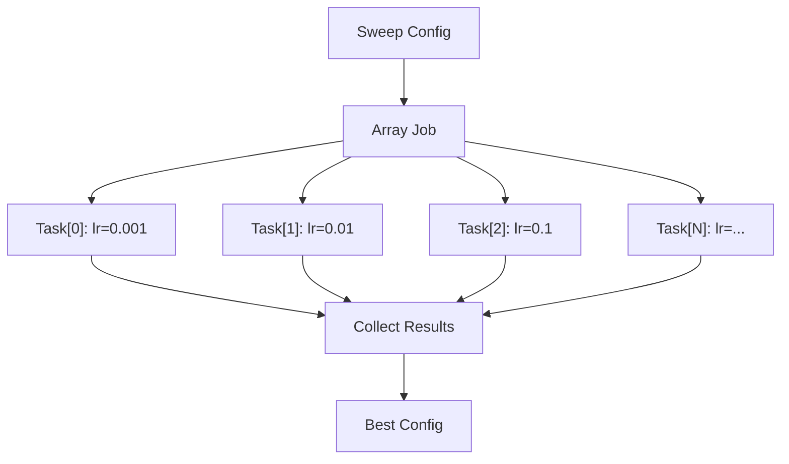
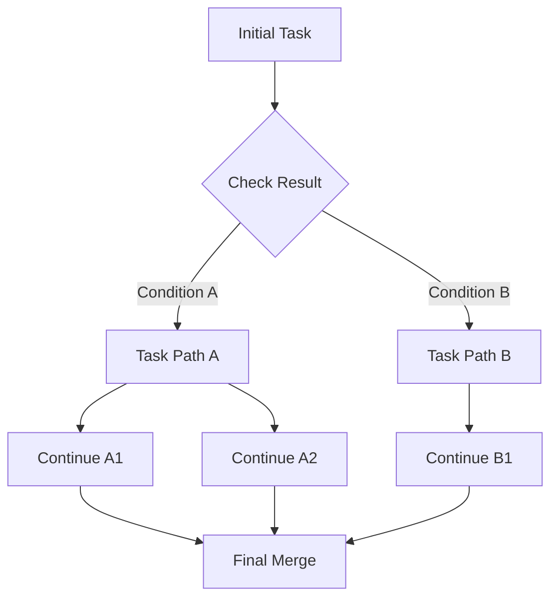

# Parallelization Patterns

Use this guide to explore fan-out/fan-in, pipeline stages, hyperparameter sweeps, and dynamic dependencies. The `slurm.examples.parallelization_patterns` example runs multiple patterns and prints progress for each phase.

## What it does
- Builds a container image from `src/slurm/examples/map_reduce.Dockerfile`.
- Runs several orchestration patterns in a single script.
- Demonstrates array jobs, dependency chaining, and dynamic task submission.

## Pattern Overview

### Fan-out / Fan-in

Process multiple items in parallel, then aggregate results:



Use `.map()` for fan-out and `.after()` for fan-in aggregation.

### Pipeline

Sequential stages where each stage's output feeds into the next:



Chain tasks using `.after()` or pass `Job` objects as arguments to automatically resolve dependencies.

### Hyperparameter Sweep

Run the same task with different configurations using array jobs:



Use `.map()` with a list of configuration dictionaries.

### Dynamic Dependencies

Submit tasks based on results from previous tasks:



Use `job.get_result()` to inspect results before deciding which tasks to submit next.

## Notes
- Use `--pattern` to run a single pattern (e.g. `fanout`, `pipeline`, `sweep`, `dynamic-deps`).
- The example prints per-pattern summaries so you can compare behaviors.

## Run this example
```bash
uv run python -m slurm.examples.parallelization_patterns \
  --hostname your-slurm-host \
  --username $USER \
  --partition debug \
  --pattern all \
  --packaging container \
  --packaging-registry registry:5000/parallel-patterns \
  --packaging-platform linux/amd64 \
  --packaging-tls-verify false
```
