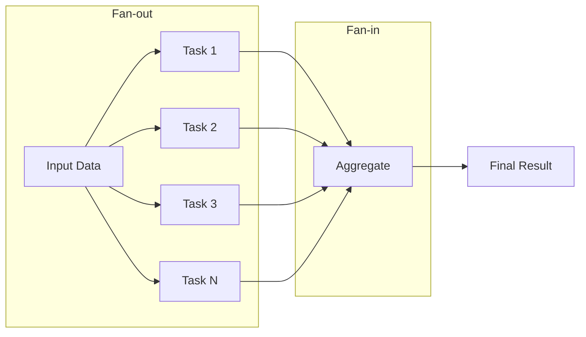
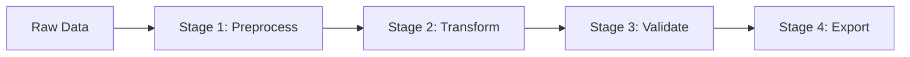
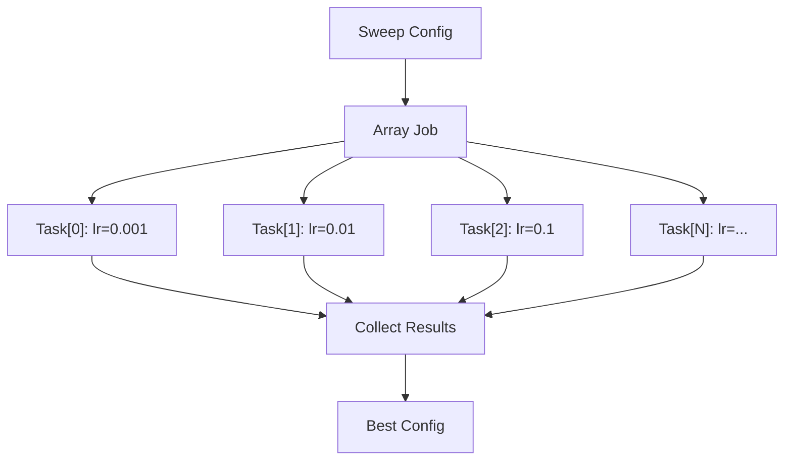
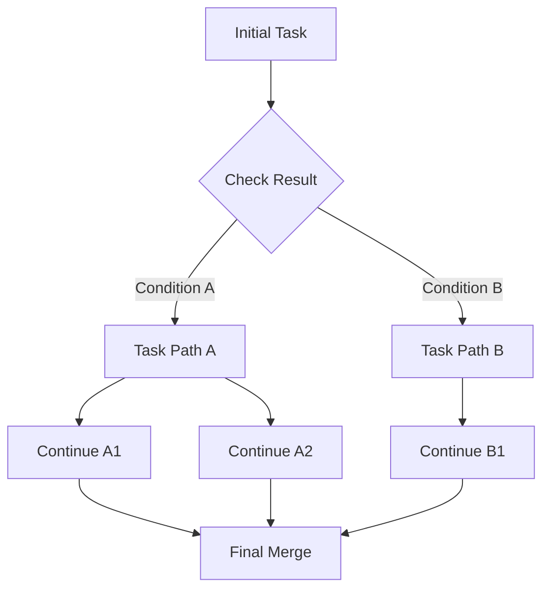

# How to choose a parallelization pattern

## Problem

You have a workload that can be parallelized on a Slurm cluster but need to
pick the right SDK pattern for your use case.

## Prerequisites

- Familiarity with the `@task` decorator and `Cluster` context
- `slurm-sdk` installed locally

## Decision table

| Use case                     | Pattern              | SDK API                                    |
| ---------------------------- | -------------------- | ------------------------------------------ |
| Same task on N items         | Fan-out/Fan-in       | `task.map(items)` then `.after()` to merge |
| Sequential stages            | Pipeline             | `task_b.after(job_a)(args)`                |
| Same task, different configs | Sweep                | `task.map(config_dicts)`                   |
| Branching based on results   | Dynamic dependencies | `job.get_result()` in a `@workflow`        |

## Fan-out / Fan-in

Process multiple items in parallel, then aggregate results in a single merge
step.


```mermaid
graph LR
    subgraph Fan-out
        A[Input Data] --> B1[Task 1]
        A --> B2[Task 2]
        A --> B3[Task 3]
        A --> B4[Task N]
    end
    subgraph Fan-in
        B1 --> C[Aggregate]
        B2 --> C
        B3 --> C
        B4 --> C
    end
    C --> D[Final Result]
```

```python
with cluster:
    # Split
    split_job = split_dataset("data.csv", num_chunks=5)
    split_job.wait()
    chunks = split_job.get_result()

    # Fan-out: process chunks in parallel
    process_jobs = process_chunk.after(split_job).map(chunks)
    process_jobs.wait()
    chunk_results = process_jobs.get_results()

    # Fan-in: merge results
    merge_job = merge_results.after(process_jobs)(chunk_results)
    merge_job.wait()
    final = merge_job.get_result()
```

`.after(process_jobs)` on a `JobArray` waits for all array tasks to complete
before the merge step runs.

## Pipeline

Sequential stages where each stage's output feeds into the next:


```mermaid
graph LR
    A[Raw Data] --> B[Stage 1: Preprocess]
    B --> C[Stage 2: Transform]
    C --> D[Stage 3: Validate]
    D --> E[Stage 4: Export]
```

```python
with cluster:
    # Each stage depends on the previous one
    stage1_job = preprocess(raw_data)
    stage1_job.wait()

    stage2_job = transform.after(stage1_job)(stage1_job.get_result())
    stage2_job.wait()

    stage3_job = validate.after(stage2_job)(stage2_job.get_result())
    stage3_job.wait()
    final = stage3_job.get_result()
```

Chain tasks using `.after()` or pass `Job` objects as arguments to
automatically resolve dependencies.

## Hyperparameter sweep

Run the same task with different configurations using array jobs:


```mermaid
graph TD
    A[Sweep Config] --> B[Array Job]
    B --> C1["Task[0]: lr=0.001"]
    B --> C2["Task[1]: lr=0.01"]
    B --> C3["Task[2]: lr=0.1"]
    B --> C4["Task[N]: lr=..."]
    C1 --> D[Collect Results]
    C2 --> D
    C3 --> D
    C4 --> D
    D --> E[Best Config]
```

```python
with cluster:
    configs = [
        {"lr": lr, "batch_size": bs, "epochs": 10, "seed": s}
        for lr in [0.001, 0.01, 0.1]
        for bs in [32, 64]
        for s in [0, 1]
    ]

    # Train all configurations in parallel
    train_jobs = train_model.map(configs)
    train_jobs.wait()
    results = train_jobs.get_results()

    # Select best
    best_job = select_best.after(train_jobs)(results)
    best_job.wait()
    best = best_job.get_result()
```

Use `.map()` with a list of configuration dictionaries. Each dict's keys must
match the task function's parameter names.

## Dynamic dependencies

Submit tasks based on results from previous tasks:


```mermaid
graph TD
    A[Initial Task] --> B{Check Result}
    B -->|Condition A| C[Task Path A]
    B -->|Condition B| D[Task Path B]
    C --> E[Continue A1]
    C --> F[Continue A2]
    D --> G[Continue B1]
    E --> H[Final Merge]
    F --> H
    G --> H
```

Use `job.get_result()` inside a `@workflow` function to inspect results before
deciding which tasks to submit next. This enables branching logic that adapts
the pipeline at runtime.

## Verification

- **Fan-out/Fan-in**: Check that all parallel tasks completed by verifying
  `map_jobs.wait()` returns `True` and `get_results()` has the expected count.
- **Pipeline**: Verify each stage's output before passing it to the next stage.
- **Sweep**: Confirm that the number of submitted tasks matches the
  configuration grid size.
- **Dynamic dependencies**: Inspect the branching logic by checking which tasks
  were actually submitted.

## See also

- [Parallelization patterns tutorial](../tutorials/parallelization_patterns.md)
  for guided examples of each pattern
- [Map-reduce tutorial](../tutorials/map_reduce.md) for a complete fan-out /
  fan-in walkthrough
- [Tasks and Workflows reference](../reference/api/tasks_workflows.md) for
  `.map()`, `.after()`, and `@workflow` API details
