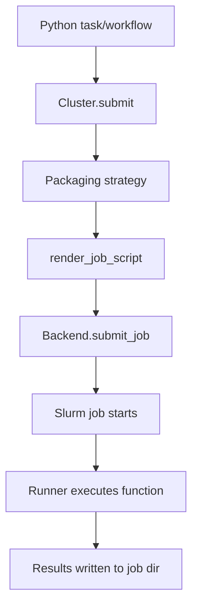

# System Overview

Slurm SDK is built around a small set of components that turn Python functions into containerized Slurm jobs.

## Core components
- **Cluster** (`slurm.cluster`): Holds backend connection details, packaging defaults, and submission behavior.
- **Backend** (`slurm.api.*`): Submits scripts and fetches logs (SSH or local).
- **Packaging** (`slurm.packaging.container`): Builds or references container images for tasks.
- **Renderer** (`slurm.rendering`): Produces the sbatch script and wires up the runner.
- **Runner** (`slurm.runner`): Executes inside the job and calls your function.
- **Callbacks** (`slurm.callbacks`): Lifecycle events for logging and instrumentation.

## Execution flow (high level)

## What gets persisted
- **Job directory**: Scripts, stdout/stderr, pickled args/kwargs, and result files.
- **Workflow directory**: A root job directory plus per-task subdirectories.
- **Environment metadata**: `.slurm_environment.json` for workflow inheritance.

## Why this structure
- **Separation of concerns**: Packaging, rendering, and execution are isolated.
- **Debuggability**: The job directory is the source of truth for execution artifacts.
- **Repeatability**: Container builds and image references are explicit and traceable.
