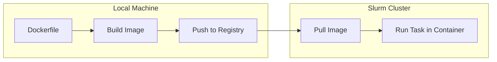

# Container Basics

This tutorial builds on [Hello World](getting_started_hello_world.md) by
exploring container packaging in more detail. You will learn how the SDK builds
and pushes container images, and how tasks run inside containers on compute
nodes.



## Prerequisites

- Docker or Podman available locally to build the image.
- A Slurm cluster with Pyxis/enroot enabled for container execution.
- A container registry accessible from both your machine and the cluster.
- A Python environment with `slurm-sdk` installed.

## What you will build

- A task that runs inside a container and reports runtime information.
- A script that demonstrates the container packaging workflow.

## Concept: container packaging

Container packaging bundles your code into a Docker/OCI image that runs
identically on any compute node. The SDK handles:

1. **Building**: Creates an image from your Dockerfile.
1. **Pushing**: Uploads the image to a container registry.
1. **Running**: Uses Pyxis/enroot to execute your task inside the container.

This approach ensures reproducible environments across different nodes.

## 1) Understand the task

Open `src/slurm/examples/hello_container.py` and examine the task:

```python
from slurm.decorators import task


@task(
    time="00:05:00",
    mem="512M",
    cpus_per_task=1,
)
def hello_container_task(greeted: str) -> str:
    """Report basic runtime information from inside the container."""
    import socket
    import time

    hostname = socket.gethostname()
    current_time = time.strftime("%Y-%m-%d %H:%M:%S")
    message = f"Hello {greeted} from {hostname} at {current_time}!"
    return message
```

Key points:

- The task accepts a parameter (`greeted`) that gets passed from your script.
- Imports happen inside the function to ensure they execute on the compute node.
- The function returns a value that the SDK serializes back to you.

## 2) Understand the Dockerfile

The SDK uses a Dockerfile to build the container image. Look at
`src/slurm/examples/hello_container.Dockerfile`:

```dockerfile
FROM python:3.11-slim

# Install the SDK
RUN pip install slurm-sdk

# Copy your code (the SDK handles this automatically)
COPY . /app
WORKDIR /app
```

Key points:

- Start from a base image with Python.
- Install the SDK and any dependencies your task needs.
- The SDK copies your code into the image during the build.

## 3) Understand the cluster context manager

The example uses a context manager to scope cluster operations:

```python
from slurm.cluster import Cluster
from slurm.callbacks.callbacks import RichLoggerCallback


cluster = Cluster.from_args(
    args,
    callbacks=[RichLoggerCallback()],
    default_packaging="container",
    default_packaging_dockerfile="src/slurm/examples/hello_container.Dockerfile",
)

with cluster:
    job = hello_container_task(greeted)
    success = job.wait()
```

Key points:

- `with cluster:` sets the cluster as the active context for job submission.
- Inside the context, you can call tasks directly without `cluster.submit()`.
- `RichLoggerCallback()` provides enhanced terminal output with progress bars.

## 4) Run the example

Execute the example with your cluster details:

```bash
uv run python -m slurm.examples.hello_container \
  --hostname your-slurm-host \
  --username $USER \
  --partition debug \
  --packaging container \
  --packaging-registry registry:5000/hello-container \
  --packaging-platform linux/amd64 \
  --packaging-tls-verify false
```

The SDK builds the image, pushes it to your registry, and runs the task.

## 5) Observe the container workflow

The output shows each stage of the container packaging process:

```
INFO     Building container image from hello_container.Dockerfile...
INFO     Successfully built image: registry:5000/hello-container:abc123
INFO     Pushing image to registry...
INFO     Push complete
INFO     Job submitted: 12346
INFO     Job running on node002
INFO     Job completed successfully
Result: Hello alice from node002 at 2025-01-10 14:35:00!
```

## 6) Understand image caching

The SDK caches container images to avoid rebuilding on every submission:

- Images are tagged with a hash of your code and Dockerfile.
- If nothing changed, the SDK reuses the existing image.
- Force a rebuild by modifying the Dockerfile or using `--packaging-force-build`.

## What you learned

- How container packaging bundles your code into reproducible images.
- How to write a Dockerfile for your tasks.
- How to use the cluster context manager for cleaner job submission.
- How the SDK caches images to speed up repeated submissions.

## Next steps

- [PyTorch Hello World](hello_torch.md): Run GPU-accelerated tasks in containers.
- [Map-Reduce Pattern](map_reduce.md): Combine container packaging with array jobs.
