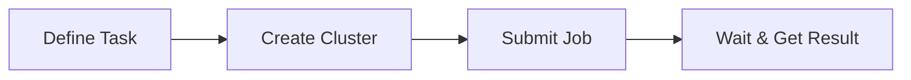

# Getting Started: Hello World

This tutorial walks you through submitting your first Slurm job using the SDK.
You will learn the core concepts of tasks, clusters, and job submission by
running a simple "Hello World" example.



## Prerequisites

- A Slurm cluster reachable by the SDK (SSH access or local backend).
- Docker or Podman available locally to build the container image.
- A Python environment with `slurm-sdk` installed.

## What you will build

- A task that runs on a Slurm compute node and returns a greeting.
- A script that submits the task and retrieves the result.

## Concept: tasks and clusters

- **Task**: A Python function decorated with `@task` that runs as a Slurm job.
  Tasks define resource requirements (time, memory, CPUs) and return values.
- **Cluster**: A connection to a Slurm cluster that handles job submission,
  monitoring, and result retrieval. The cluster manages packaging (how your
  code reaches the compute nodes).

## 1) Understand the task definition

The SDK uses a decorator to mark functions as Slurm tasks. Open
`src/slurm/examples/hello_world.py` and look at the task:

```python
from slurm.decorators import task


@task(
    time="00:05:00",
    mem="1G",
    cpus_per_task=1,
)
def hello_world() -> str:
    """A simple hello world task."""
    import socket
    import time

    hostname = socket.gethostname()
    current_time = time.strftime("%Y-%m-%d %H:%M:%S")
    message = f"Hello from {hostname} at {current_time}!"
    return message
```

Key points:

- `time="00:05:00"` requests a 5-minute time limit.
- `mem="1G"` requests 1 GB of memory.
- `cpus_per_task=1` requests 1 CPU core.
- The function returns a string that the SDK serializes and returns to you.

## 2) Understand the cluster setup

The example uses argparse helpers to configure the cluster connection:

```python
from slurm.cluster import Cluster
from slurm.callbacks.callbacks import LoggerCallback


parser = argparse.ArgumentParser(description="Submit a simple hello world job")
Cluster.add_argparse_args(parser)
args = parser.parse_args()

cluster = Cluster.from_args(
    args,
    callbacks=[LoggerCallback()],
    default_packaging="container",
    default_packaging_dockerfile="src/slurm/examples/hello_world.Dockerfile",
)
```

Key points:

- `Cluster.add_argparse_args()` adds standard flags like `--hostname`,
  `--username`, and `--partition`.
- `Cluster.from_args()` creates a cluster from the parsed arguments.
- `LoggerCallback()` prints job status updates to your terminal.
- `default_packaging="container"` uses container packaging for all jobs.

## 3) Understand job submission

The example submits the task and waits for the result:

```python
from slurm.job import Job

job: Job[str] = cluster.submit(hello_world)()

success = job.wait()
if success:
    result: str = job.get_result()
    print(f"Result: {result}")
else:
    print("Job failed!")
    print(job.get_stderr())
```

Key points:

- `cluster.submit(hello_world)` prepares the task for submission.
- The second `()` actually submits it (you can pass arguments here).
- `job.wait()` blocks until the job completes.
- `job.get_result()` retrieves the returned value from the task.

## 4) Run the example

Execute the example with your cluster details:

```bash
uv run python -m slurm.examples.hello_world \
  --hostname your-slurm-host \
  --username $USER \
  --partition debug \
  --packaging container \
  --packaging-registry registry:5000/hello-world \
  --packaging-platform linux/amd64 \
  --packaging-tls-verify false
```

Replace `your-slurm-host`, partition, and registry with your cluster's values.

## 5) Observe the output

The SDK prints status updates as the job progresses:

```
INFO     Building container image...
INFO     Pushing to registry...
INFO     Job submitted: 12345
INFO     Job running on node001
INFO     Job completed successfully
Result: Hello from node001 at 2025-01-10 14:30:00!
```

The final line shows the return value from your task, including the hostname
of the compute node where it ran.

## 6) Inspect job output (optional)

If the job fails, you can inspect the stdout and stderr:

```python
print(job.get_stdout())
print(job.get_stderr())
```

These methods retrieve the Slurm job's output files from the cluster.

## What you learned

- How to define a task with the `@task` decorator and resource requirements.
- How to create a cluster connection using argparse helpers.
- How to submit a job and retrieve its result.
- How to use callbacks to monitor job progress.

## Next steps

- [Container Basics](container_basics_hello_container.md): Learn more about
  container packaging options.
- [Map-Reduce Pattern](map_reduce.md): Run parallel jobs with array tasks.
