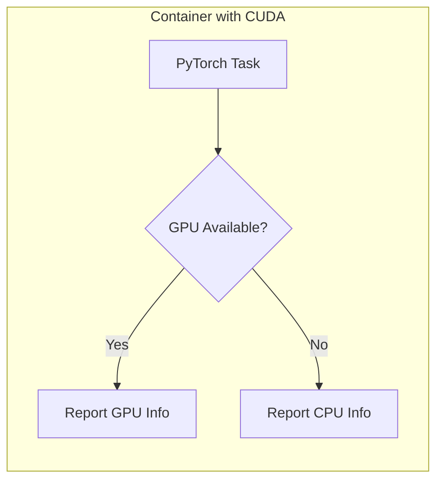

# PyTorch Hello World

This tutorial shows how to run PyTorch tasks on GPU-enabled compute nodes.
You will learn how to detect available hardware, configure GPU resources,
and set up a container with CUDA support.



## Prerequisites

- A Slurm cluster with GPU nodes and CUDA drivers installed.
- Docker or Podman with GPU support for building images.
- Pyxis/enroot configured for GPU container execution.
- A Python environment with `slurm-sdk` installed.

## What you will build

- A task that detects and reports PyTorch and CUDA availability.
- A container image with PyTorch and CUDA support.

## Concept: GPU tasks

GPU tasks require:

1. **Container with CUDA**: A base image with CUDA libraries and PyTorch.
1. **Resource requests**: Slurm needs to know you want GPU resources.
1. **Hardware detection**: Your task should verify GPU availability at runtime.

The SDK handles Slurm flags; you focus on your task logic.

## 1) Understand the task

Open `src/slurm/examples/hello_torch.py` and examine the task:

```python
from slurm import task


@task(
    nodes=1,
    ntasks_per_node=1,
    time="00:03:00",
    mem="512M",
)
def hello_torch() -> str:
    import os
    import socket
    import torch

    hostname = socket.gethostname()
    cpu_count = os.cpu_count() or 1

    cuda_available = torch.cuda.is_available()
    cuda_devices = torch.cuda.device_count() if cuda_available else 0

    if cuda_available and cuda_devices > 0:
        for i in range(cuda_devices):
            print(f"  GPU {i}: {torch.cuda.get_device_name(i)}")
        cuda_version = torch.version.cuda or "N/A"
        return f"PyTorch {torch.__version__} with CUDA {cuda_version}, {cuda_devices} GPU(s), {cpu_count} CPU(s)"
    else:
        return f"PyTorch {torch.__version__} (CPU only), {cpu_count} CPU(s)"
```

Key points:

- The task detects whether CUDA is available using `torch.cuda.is_available()`.
- It reports GPU names and counts using `torch.cuda` methods.
- The return value summarizes the hardware configuration.

## 2) Understand the Dockerfile

GPU containers need a CUDA-enabled base image. Look at
`src/slurm/examples/hello_torch.Dockerfile`:

```dockerfile
FROM pytorch/pytorch:2.0.1-cuda11.7-cudnn8-runtime

# Install the SDK
RUN pip install slurm-sdk

# Copy your code
COPY . /app
WORKDIR /app
```

Key points:

- Use an official PyTorch image with CUDA support.
- The `runtime` variant is smaller than `devel` (no compiler).
- Match the CUDA version to your cluster's drivers.

## 3) Request GPU resources

To request GPUs, add the `gpus` parameter to your task decorator:

```python
@task(
    nodes=1,
    ntasks_per_node=1,
    time="00:03:00",
    mem="512M",
    gpus=1,  # Request 1 GPU
)
def gpu_task() -> str:
    ...
```

Or specify GPU type with `gres`:

```python
@task(
    nodes=1,
    ntasks_per_node=1,
    time="00:03:00",
    mem="512M",
    gres="gpu:a100:1",  # Request 1 A100 GPU
)
def a100_task() -> str:
    ...
```

## 4) Run the example

Execute the example with your cluster details:

```bash
uv run python -m slurm.examples.hello_torch \
  --hostname your-slurm-host \
  --username $USER \
  --partition gpu \
  --packaging container \
  --packaging-registry registry:5000/hello-torch \
  --packaging-platform linux/amd64 \
  --packaging-tls-verify false
```

Use a partition with GPU nodes (often named `gpu` or similar).

## 5) Observe GPU detection

The output shows the detected hardware:

```
INFO     Building container image...
INFO     Job submitted: 12347
INFO     Job running on gpu-node001
  GPU 0: NVIDIA A100-SXM4-40GB
INFO     Job completed successfully
Result: PyTorch 2.0.1 with CUDA 11.7, 1 GPU(s), 64 CPU(s)
```

If no GPU is available, you'll see CPU-only output instead.

## 6) Handle GPU unavailability

Good tasks handle missing GPUs gracefully:

```python
@task(time="00:03:00", mem="512M")
def flexible_task() -> str:
    import torch

    device = torch.device("cuda" if torch.cuda.is_available() else "cpu")
    tensor = torch.randn(100, 100, device=device)
    return f"Computed on {device}"
```

This pattern lets you test locally on CPU before running on GPU clusters.

## What you learned

- How to create containers with CUDA and PyTorch support.
- How to request GPU resources in task decorators.
- How to detect available hardware at runtime.
- How to write tasks that work on both CPU and GPU.

## Next steps

- [Map-Reduce Pattern](map_reduce.md): Run parallel jobs across multiple nodes.
- [Parallelization Patterns](parallelization_patterns.md): Explore advanced
  parallel execution patterns.
