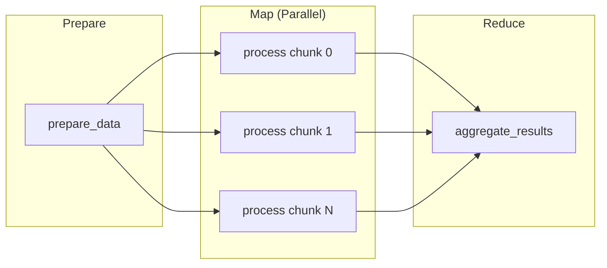

# Map-Reduce Pattern

This tutorial teaches the map-reduce pattern using Slurm array jobs. You will
learn how to split work across multiple parallel tasks, process data
concurrently, and aggregate results.



## Prerequisites

- A Slurm cluster reachable by the SDK.
- Docker or Podman available locally.
- A Python environment with `slurm-sdk` installed.

## What you will build

- A preparation task that creates data chunks.
- A map task that processes chunks in parallel using array jobs.
- A reduce task that aggregates all results.

## Concept: array jobs and map

Slurm array jobs run the same task with different inputs in parallel:

- **Array job**: One submission that spawns multiple independent tasks.
- **map()**: The SDK's method to submit array jobs from a list of inputs.
- **Dependencies**: You can chain tasks so reduce waits for all map tasks.

This pattern maximizes cluster utilization by running work in parallel.

## 1) Define the preparation task

The prep task creates data chunks for processing:

```python
from slurm.decorators import task
from typing import List


@task(
    time="00:02:00",
    mem="256M",
    cpus_per_task=1,
)
def prepare_data(num_chunks: int) -> List[dict]:
    """Prepare data by creating chunks for parallel processing."""
    chunks = []
    for i in range(num_chunks):
        chunk = {
            "chunk_id": i,
            "data": list(range(i * 100, (i + 1) * 100)),
            "description": f"Chunk {i}",
        }
        chunks.append(chunk)
    return chunks
```

Key points:

- Returns a list of dictionaries, one per chunk.
- Each chunk contains an ID and the data to process.
- The SDK serializes and returns this list to your script.

## 2) Define the map task

The map task processes a single chunk:

```python
@task(
    time="00:03:00",
    mem="256M",
    cpus_per_task=1,
)
def map_process_chunk(chunk_id: int, data: List[int], description: str) -> dict:
    """Process a single data chunk (MAP phase)."""
    import socket
    import time

    hostname = socket.gethostname()
    start_time = time.time()

    result = {
        "chunk_id": chunk_id,
        "count": len(data),
        "sum": sum(data),
        "min": min(data),
        "max": max(data),
        "mean": sum(data) / len(data),
        "processed_on": hostname,
        "processing_time": time.time() - start_time,
    }
    return result
```

Key points:

- Accepts the fields from a single chunk dictionary.
- Computes statistics and records which node processed it.
- Returns a result dictionary for later aggregation.

## 3) Define the reduce task

The reduce task combines all results:

```python
@task(
    time="00:05:00",
    mem="512M",
    cpus_per_task=1,
)
def reduce_aggregate_results(results: List[dict]) -> dict:
    """Aggregate results from all processed chunks (REDUCE phase)."""
    import socket

    hostname = socket.gethostname()

    total_count = sum(r["count"] for r in results)
    total_sum = sum(r["sum"] for r in results)
    global_min = min(r["min"] for r in results)
    global_max = max(r["max"] for r in results)

    hosts_used = set(r["processed_on"] for r in results)

    return {
        "total_chunks": len(results),
        "total_count": total_count,
        "total_sum": total_sum,
        "global_min": global_min,
        "global_max": global_max,
        "global_mean": total_sum / total_count,
        "hosts_used": list(hosts_used),
        "reduced_on": hostname,
    }
```

## 4) Orchestrate with map() and dependencies

The main script chains the tasks together:

```python
from slurm.cluster import Cluster
from slurm.job import Job

with cluster:
    # Step 1: Prepare data chunks
    prep_job: Job[List[dict]] = prepare_data(num_chunks=5)
    prep_job.wait()
    chunks = prep_job.get_result()

    # Step 2: Map - process chunks in parallel
    # .after(prep_job) ensures the array waits for prep
    # .map(chunks) submits one task per chunk
    map_jobs = map_process_chunk.after(prep_job).map(chunks)
    map_jobs.wait()
    map_results = map_jobs.get_results()

    # Step 3: Reduce - aggregate all results
    # .after(map_jobs) waits for ALL map tasks
    reduce_job = reduce_aggregate_results.after(map_jobs)(map_results)
    reduce_job.wait()
    final = reduce_job.get_result()
```

Key points:

- `.after(job)` creates a dependency on the specified job.
- `.map(items)` submits an array job with one task per item.
- `.after(map_jobs)` on the reduce task waits for all map tasks.
- `map_jobs.get_results()` returns a list of all map task results.

## 5) Run the example

Execute the map-reduce example:

```bash
uv run python -m slurm.examples.map_reduce \
  --hostname your-slurm-host \
  --username $USER \
  --partition debug \
  --num-chunks 5 \
  --packaging container \
  --packaging-registry registry:5000/map-reduce \
  --packaging-platform linux/amd64 \
  --packaging-tls-verify false
```

## 6) Observe parallel execution

The output shows the workflow progression:

```
[1/3] Preparing 5 data chunks...
      Created 5 chunks

[2/3] Mapping: Processing 5 chunks in parallel...
      Pattern: map_process_chunk.after(prep_job).map(chunks)
      Submitted 5 parallel jobs
      Waiting for all map jobs to complete...
      Completed 5 map jobs

[3/3] Reducing: Aggregating results...
      Pattern: reduce_aggregate_results.after(*map_jobs)(map_results)
      Waiting for reduce job to complete...
      Reduce complete

Final Results:
  Total Chunks: 5
  Total Items:  500
  Sum:          124750
  Hosts Used:   3 (node001, node002, node003)
```

Notice that chunks were distributed across multiple nodes.

## 7) Understand the array job structure

When you call `.map(chunks)`, the SDK:

1. Creates a Slurm array job with indices 0 to N-1.
1. Each array task receives one chunk's parameters.
1. Results are collected in order matching the input.

```python
# This single call submits 5 parallel tasks
map_jobs = map_process_chunk.map(chunks)

# Equivalent to submitting 5 individual jobs, but more efficient
```

## What you learned

- How to design a map-reduce workflow with three stages.
- How to use `.map()` to submit array jobs from a list.
- How to use `.after()` to chain task dependencies.
- How Slurm distributes array tasks across available nodes.

## Next steps

- [Parallelization Patterns](parallelization_patterns.md): Explore fan-out/fan-in,
  pipelines, and parameter sweeps.
- [Workflow Graph Visualization](workflow_graph_visualization.md): Visualize
  complex workflow structures.
