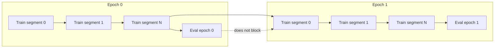

# Parallel Train + Eval Workflow

This tutorial walks you through building a production-style training workflow
that tolerates preemption/time limits by splitting each epoch across multiple
jobs, while launching evaluation in parallel. You will use the SDK's
`@task` and `@workflow` decorators to express this orchestration pattern.



## Prerequisites

- A Slurm cluster reachable by the SDK (SSH or local backend).
- A Python environment with `slurm-sdk` installed.

## Concept: task vs workflow

- **Task**: a single unit of work that runs as a Slurm job (e.g., a training
  segment or an eval pass). Tasks return values and can write artifacts.
- **Workflow**: an orchestrator that runs on Slurm and submits tasks, controls
  dependencies, and coordinates artifacts across jobs.

In this tutorial, training and evaluation are **tasks**, while the controller
that sequences epochs and submits eval in parallel is a **workflow**.

## What you will build

- A training task that runs a capped number of steps and writes a checkpoint.
- An eval task that consumes a checkpoint and writes metrics.
- A workflow that loops over epochs, submits multiple training jobs, and fires
  eval without blocking the next epoch.

## 1) Create a tiny state helper

We will store simple JSON artifacts so you can inspect progress later.
Create `src/slurm/examples/parallel_train_eval/state.py`:

```python
from __future__ import annotations

import json
from pathlib import Path
from typing import Any, Dict


def write_json(path: Path, payload: Dict[str, Any]) -> None:
    path.parent.mkdir(parents=True, exist_ok=True)
    path.write_text(
        json.dumps(payload, indent=2, sort_keys=True) + "\n",
        encoding="utf-8",
    )


def read_json(path: Path) -> Dict[str, Any]:
    return json.loads(path.read_text(encoding="utf-8"))
```

Why? In production you often need a durable handoff between jobs. JSON on a
shared filesystem is the simplest reliable option.

## 2) Add a capped training task

This task advances the epoch by at most `steps_per_job_cap` and writes the
checkpoint with the cumulative step count.

Create `src/slurm/examples/parallel_train_eval/train_task.py`:

```python
from __future__ import annotations

import logging
from pathlib import Path
from typing import Any, Dict

from slurm.decorators import task
from slurm.logging import configure_logging

from slurm.examples.parallel_train_eval.state import write_json


@task(time="00:05:00", mem="256M", cpus_per_task=1)
def train_epoch_segment(
    epoch: int,
    start_step: int,
    steps_to_run: int,
    epoch_steps: int,
    workdir: str,
    job_index: int,
) -> Dict[str, Any]:
    configure_logging()
    logger = logging.getLogger(__name__)

    remaining_steps = max(epoch_steps - start_step, 0)
    steps_this_job = min(steps_to_run, remaining_steps)
    end_step = start_step + steps_this_job

    checkpoint_path = (
        Path(workdir).expanduser()
        / "checkpoints"
        / f"epoch_{epoch:03d}.json"
    )
    write_json(
        checkpoint_path,
        {
            "epoch": epoch,
            "job_index": job_index,
            "start_step": start_step,
            "steps_this_job": steps_this_job,
            "steps_completed": end_step,
            "epoch_steps": epoch_steps,
        },
    )

    logger.info("Epoch %s job %s -> steps %s", epoch, job_index, end_step)
    return {"steps_completed": end_step, "checkpoint_path": str(checkpoint_path)}
```

What this teaches: a single Slurm job can move the training state forward and
persist a checkpoint so the next job can continue.

## 3) Add the eval task

Eval consumes the checkpoint and writes metrics without blocking training.

Create `src/slurm/examples/parallel_train_eval/eval_task.py`:

```python
from __future__ import annotations

import logging
from pathlib import Path
from typing import Any, Dict

from slurm.decorators import task
from slurm.logging import configure_logging

from slurm.examples.parallel_train_eval.state import read_json, write_json


@task(time="00:03:00", mem="256M", cpus_per_task=1)
def evaluate_epoch(epoch: int, checkpoint_path: str, workdir: str) -> Dict[str, Any]:
    configure_logging()
    logger = logging.getLogger(__name__)

    checkpoint = read_json(Path(checkpoint_path))
    metrics_path = (
        Path(workdir).expanduser()
        / "metrics"
        / f"epoch_{epoch:03d}.json"
    )
    write_json(
        metrics_path,
        {
            "epoch": epoch,
            "checkpoint_path": checkpoint_path,
            "steps_completed": checkpoint.get("steps_completed"),
            "accuracy": round(0.75 + (epoch * 0.01), 4),
            "loss": round(1.0 / (1 + epoch + 1), 4),
        },
    )

    logger.info("Epoch %s eval -> %s", epoch, metrics_path)
    return {"metrics_path": str(metrics_path)}
```

## 4) Build the workflow

The workflow owns the orchestration and uses its shared directory for all
artifacts (`WorkflowContext.shared_dir`). The key behavior is:

- Repeat train jobs until the epoch reaches `epoch_steps`.
- Submit eval after each epoch, but do **not** wait for it before starting the
  next epoch.

Create `src/slurm/examples/parallel_train_eval/workflow.py` and focus on this
core loop:

```python
from pathlib import Path
from typing import Any, List, Optional

@workflow(time="00:20:00", mem="512M", cpus_per_task=1)
def parallel_train_eval_workflow(
    epochs: int,
    epoch_steps: int,
    steps_per_job_cap: int,
    partition_train: Optional[str],
    partition_eval: Optional[str],
    ctx: WorkflowContext,
) -> str:
    workdir_path = Path(ctx.shared_dir)
    (workdir_path / "checkpoints").mkdir(parents=True, exist_ok=True)
    (workdir_path / "metrics").mkdir(parents=True, exist_ok=True)

    eval_jobs: List[tuple[int, Any]] = []

    for epoch in range(epochs):
        steps_completed = 0
        job_index = 0
        last_train_job = None
        checkpoint_path = None

        while steps_completed < epoch_steps:
            job_index += 1
            steps_this_job = min(steps_per_job_cap, epoch_steps - steps_completed)

            train_task = train_epoch_segment
            if partition_train:
                train_task = train_task.with_options(partition=partition_train)

            train_job = train_task(
                epoch=epoch,
                start_step=steps_completed,
                steps_to_run=steps_this_job,
                epoch_steps=epoch_steps,
                workdir=str(workdir_path),
                job_index=job_index,
            )
            last_train_job = train_job

            result = train_job.get_result()
            steps_completed = int(result["steps_completed"])
            checkpoint_path = str(result["checkpoint_path"])

        eval_task = evaluate_epoch
        if partition_eval:
            eval_task = eval_task.with_options(partition=partition_eval)

        eval_job = eval_task.after(last_train_job)(
            epoch=epoch,
            checkpoint_path=checkpoint_path,
            workdir=str(workdir_path),
        )
        eval_jobs.append((epoch, eval_job))

    for epoch, eval_job in eval_jobs:
        eval_job.wait()

    return str(workdir_path / "state.json")
```

Why this matters for production pipelines:

- The training state is advanced in small, resumable segments.
- Eval is decoupled so training can keep moving even under scheduling pressure.
- All artifacts are collected under a single workflow-run directory.

## 5) Run the workflow

```bash
uv run python -m slurm.examples.parallel_train_eval.workflow \
  --hostname your-slurm-host \
  --username $USER \
  --partition debug \
  --epochs 3 \
  --epoch-steps 10 \
  --steps-per-job-cap 4
```

Optional partition overrides:

```bash
uv run python -m slurm.examples.parallel_train_eval.workflow \
  --hostname your-slurm-host \
  --username $USER \
  --partition debug \
  --partition-workflow debug \
  --partition-train compute \
  --partition-eval compute \
  --epochs 3 \
  --epoch-steps 10 \
  --steps-per-job-cap 4
```

## 6) Inspect the artifacts

The workflow writes to its shared directory (`WorkflowContext.shared_dir`). The
final state path is printed in the workflow output. Use that path to inspect the
files.

Example commands:

```bash
cat /path/from/output/state.json
ls -la /path/from/output/checkpoints
ls -la /path/from/output/metrics
cat /path/from/output/checkpoints/epoch_000.json
cat /path/from/output/metrics/epoch_000.json
```

## What you learned

- How to design a workflow that survives preemption by splitting epochs into
  multiple jobs.
- How to launch evaluation in parallel without blocking training.
- How to use `WorkflowContext.shared_dir` to keep all artifacts in one place.
