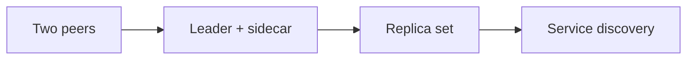

# Your first multi-peer job

This tutorial walks you through `parallel(...)` — the SDK primitive for
running several coordinated tasks inside a single Slurm allocation. You will
start with a trivial two-peer call, add a sidecar to a training loop, and
finish with a replica set that fans out identical work across many indices.
Every step is runnable against the local backend without a Slurm cluster.



## Prerequisites

- A Python environment with `slurm-sdk` installed (`uv sync` in the repo).
- No Slurm cluster required — the tutorial uses `Cluster(backend_type="local")`,
  which launches peers as local subprocesses.
- Familiarity with `@task` and `Cluster` from
  [Getting Started](getting_started_hello_world.md).

## Concepts you will meet

- **Peer** — one running task inside the allocation. A peer maps to one
  `srun` step on a real cluster, or to one `subprocess.Popen` in local mode.
- **Leader** — the peer whose exit triggers group shutdown. Used for "main
  computation plus helpers" shapes where the helpers exist only to support
  the leader.
- **Replica set** — N copies of the same task, each with its own replica
  index. Fan-out without boilerplate.
- **Service discovery** — peers find one another at runtime through
  `ctx.peers`, so a training peer can dial the metrics server using a
  hostname it discovers instead of one hard-coded ahead of time.

## 1) Two peers, no leader

Start with the simplest shape: two peers, both must succeed. If either fails
the group aborts.

Save this as `first_parallel.py` in any writable directory:

```python
"""Two peers running concurrently in one local allocation."""

import logging
import os
import socket
import tempfile

from slurm import Cluster, Peer, parallel, task


@task(time="00:02:00", mem="256M", cpus_per_task=1)
def greet_ocean() -> str:
    return f"ocean on {socket.gethostname()} (pid {os.getpid()})"


@task(time="00:02:00", mem="256M", cpus_per_task=1)
def greet_atmosphere() -> str:
    return f"atmosphere on {socket.gethostname()} (pid {os.getpid()})"


def main() -> None:
    logging.basicConfig(level=logging.INFO)
    base = tempfile.mkdtemp(prefix="slurm_sdk_first_parallel_")
    cluster = Cluster(
        backend_type="local",
        job_base_dir=base,
        default_packaging="none",
    )
    with cluster:
        job = parallel(greet_ocean, greet_atmosphere)
        job.wait()
        results = job.get_results()

    print(results["greet_ocean"])
    print(results["greet_atmosphere"])


if __name__ == "__main__":
    main()
```

Run it:

```bash
uv run python first_parallel.py
```

You should see two lines with different PIDs — proof the peers ran
concurrently in separate processes.

### What just happened

- `parallel(greet_ocean, greet_atmosphere)` submitted one allocation with
  two peer steps. Because you did not pass `topology=`, the SDK inferred a
  single-node pool that fits both peers.
- `job.get_results()` returned a dict keyed by peer name. The name comes
  from the task function's `__name__`, so the keys are `greet_ocean` and
  `greet_atmosphere`.
- The default failure policy is `on_failure="kill"`. Either peer raising
  would abort the whole allocation.

## 2) Name your peers

Relying on function names is fine for two peers, but once peers share a
function (or have verbose names) you'll want explicit names. `parallel(...)`
accepts keyword arguments whose names become the peer keys:

```python
with cluster:
    job = parallel(ocean=greet_ocean, atmo=greet_atmosphere)
    job.wait()
    r = job.get_results()
    print(r["ocean"], r["atmo"])
```

Keyword-named peers keep the call site self-documenting and give you stable
keys even if you later rename the underlying function.

## 3) Pre-bind arguments with `.partial(...)`

Tasks rarely run with zero arguments. `SlurmTask.partial(...)` captures args
for a multi-peer API without submitting:

```python
@task(time="00:02:00", mem="256M")
def run_model(label: str, steps: int) -> dict:
    return {"label": label, "steps": steps, "host": socket.gethostname()}


with cluster:
    job = parallel(
        ocean=run_model.partial("ocean", steps=10),
        atmo=run_model.partial("atmosphere", steps=20),
    )
    print(job.get_results())
```

`.partial(...)` returns a `BoundTask` — a handle you can pass to `parallel`,
`Peer`, or `task.with_sidecars(...)`. A `BoundTask` is **not** directly
callable; calling it raises `TypeError` to nudge you toward the multi-peer
primitives.

## 4) Add a leader and a sidecar

The "one main task plus helpers" shape is common enough to have its own
pattern. Mark the primary peer `leader=True` and give helpers
`on_failure="continue"`:

```python
import time as _time

from slurm import JobContext


@task(time="00:01:00", mem="256M")
def train(steps: int) -> dict:
    for i in range(steps):
        _time.sleep(0.05)
    return {"steps": steps, "status": "done"}


@task(time="00:01:00", mem="128M")
def metrics(ctx: JobContext) -> None:
    # Pure-Python loops poll ctx.shutdown_requested so they exit cleanly
    # when the leader signals shutdown.
    while not ctx.shutdown_requested:
        _time.sleep(0.1)


with cluster:
    job = parallel(
        Peer(train.partial(steps=20), leader=True),
        Peer(metrics, on_failure="continue"),
    )
    result = job.leader_result
    print("training finished:", result)
```

Key things to note:

- `Peer(...)` wraps a task when you need lifecycle directives
  (`leader=True`, `on_failure="continue"`). A bare task or `BoundTask` is
  auto-wrapped into a `Peer` with defaults.
- When the leader exits — success or failure — the supervisor signals every
  other peer with `SIGTERM`, waits out `grace_period_seconds`, and hard-
  cancels stragglers. Your metrics loop breaks out when `ctx.shutdown_requested`
  flips to `True`.
- `job.leader_result` returns the leader's deserialised return value
  directly. It raises if the job has zero or multiple leaders, so the
  shortcut stays unambiguous.
- `on_failure="continue"` tells the supervisor "this peer's failure is
  expected and non-fatal." Without it, a sidecar crashing would abort the
  job.

## 5) The `with_sidecars(...)` shortcut

The leader + helpers shape deserves a one-liner. `SlurmTask.with_sidecars(...)`
desugars to the same `parallel(Peer(..., leader=True), Peer(..., on_failure="continue"))`:

```python
with cluster:
    job = train.with_sidecars(metrics)(steps=20)
    print(job.leader_result)
```

- The receiver (`train`) becomes `leader=True`.
- Every sidecar becomes `on_failure="continue"` unless you pre-wrap it in a
  `Peer(...)` with an explicit policy.
- Calling the returned bundle (`(steps=20)`) submits the allocation; the
  args you pass go to the leader.

Use `with_sidecars` when the shape fits; drop back to a hand-written
`parallel(Peer(...), ...)` call when you need multiple leader candidates or
custom per-peer directives.

## 6) Fan out with `Peer.replicas(...)`

A replica set is N copies of the same task running concurrently. Each
replica gets its own index so you can shard work without writing a loop:

```python
@task(time="00:01:00", mem="128M", cpus_per_task=1)
def worker(shard_id: int) -> dict:
    return {"shard": shard_id, "host": socket.gethostname()}


with cluster:
    job = parallel(
        workers=Peer.replicas(
            worker,
            count=4,
            args=lambda i: {"shard_id": i},
        ),
    )
    results = job.get_results()

for r in results["workers"]:
    print(r)
```

What changed:

- `Peer.replicas(worker, count=4, args=lambda i: {"shard_id": i})` declares
  a replica set. The SDK launches one `srun --ntasks=4` step (or four
  subprocesses in local mode) and feeds each replica its own index.
- The `args=` callable runs **once per replica** with the replica index.
  You can also pass a list (`args=[{"shard_id": 0}, ...]`) or a `range`
  (`args=range(4)` feeds the index positionally).
- `results["workers"]` is a **list** of length 4 — one entry per replica,
  in index order. Singleton peers return a scalar; replica peers always
  return a list, so iteration is uniform.

Replica peers are never leaders — their failure policy applies per-replica,
not per-group.

## 7) Discover other peers at runtime

Peers can find each other at runtime through `ctx.peers`. This is how a
worker dials a coordinator without any hardcoded hostname.

```python
@task(time="00:01:00", mem="128M")
def coordinator(ctx: JobContext) -> str:
    # Announce once, then hold the process open so workers see us.
    ctx.announce(ready=True, endpoint=f"tcp://{socket.gethostname()}:9000")
    while not ctx.shutdown_requested:
        _time.sleep(0.05)
    return "coordinator stopped"


@task(time="00:01:00", mem="128M")
def worker(ctx: JobContext) -> dict:
    # Block until the coordinator has announced itself.
    ctx.peers["coordinator"].wait_all(keys=["endpoint"], timeout=5.0)
    coord = ctx.peers["coordinator"].first
    return {"dialed": coord.metadata["endpoint"]}


with cluster:
    job = parallel(
        Peer(coordinator, leader=True),
        workers=Peer.replicas(worker, count=2),
    )
    results = job.get_results()

for r in results["workers"]:
    print(r)
```

The mechanics:

- `ctx.announce(...)` writes arbitrary key/value pairs into the peer
  registry atomically. Other peers see the update after calling
  `ctx.peers[name].refresh()` or `wait_all(...)`.
- `ctx.peers["coordinator"].wait_all(keys=["endpoint"], timeout=5.0)`
  polls the registry until every coordinator replica has announced an
  `endpoint` key.
- `ctx.peers["coordinator"].first` returns the first replica's
  `PeerInfo`. Its `metadata` is whatever the coordinator announced plus
  the bootstrap metadata (hostname, pool).
- The coordinator is `leader=True`, so when the worker replicas finish
  the leader is still running. Declaring a leader is what tells the
  supervisor to terminate the allocation once the orchestrating peer
  exits — otherwise the allocation would hang.

In this snippet the worker finishes first and the coordinator keeps
running. Add a small self-terminating coordinator or promote a worker to
leader if you want a more realistic shape.

## 8) Run a verified smoke test

You've just written your own local-mode parallel job. The SDK ships a
curated smoke example you can run to confirm the pipeline is healthy on
your machine:

```bash
uv run python -m slurm.examples.parallel_simple
```

Expected output (hostnames and pids will differ):

```text
INFO     Submitting parallel allocation: 2 peer(s), 1 pool(s)
...
Leader result: hello from leader on your-host (pid 12345)
Sidecar result: 12346
parallel_simple smoke passed.
```

The example uses exactly the leader + sidecar pattern from step 4, backed
by `Cluster(backend_type="local")`. If it passes, every piece of this
tutorial should run on your machine too.

## Troubleshooting

- **"RuntimeError: ParallelJob.leader_result requires exactly one leader
  peer"** — you didn't declare `leader=True` on any peer, or you declared
  it on more than one. Either add it, or call `get_results()` instead and
  pick the value you want.
- **Peers appear to hang after the leader exits** — your sidecar is not
  checking `ctx.shutdown_requested` and is not running a subprocess that
  inherits `SIGTERM`. Pure-Python loops must poll the flag.
- **"TopologyError: local host has N CPUs, parallel() requires M"** —
  scale down `count=` / `cpus_per_task` / `mem` until the aggregate
  claim fits on your workstation. The local backend checks capacity
  before launch so expensive jobs don't thrash your laptop.

## What you learned

- Submitting a multi-peer allocation with `parallel(...)` and keyword-named
  peers.
- Pre-binding arguments with `.partial(...)` and why `BoundTask` is not
  callable.
- The leader + sidecar shape with `Peer(..., leader=True)` + `on_failure=`
  and the `with_sidecars(...)` shortcut.
- Fan-out with `Peer.replicas(count=N, args=...)` and the list-shape result.
- Service discovery with `ctx.peers`, `ctx.announce(...)`, and
  `wait_all(...)`.

## Next steps

- [Add sidecars to a training job](../how-to/sidecars.md) — the production-
  oriented recipe.
- [Run N copies of a task in parallel](../how-to/replica_sets.md) —
  deeper patterns for replica sets (list / callable / range).
- [Discover other peers at runtime](../how-to/service_discovery.md) — the
  full `ctx.peers` / `ctx.announce` surface.
- [How parallel allocations work](../explanation/slurm_allocations.md) —
  the Slurm internals behind `parallel(...)`.
