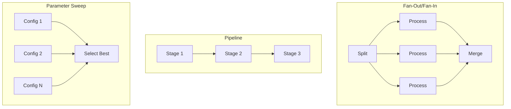

# Parallelization Patterns

This tutorial explores advanced parallel execution patterns beyond basic
map-reduce. You will learn fan-out/fan-in, multi-stage pipelines, and
hyperparameter sweeps.



## Prerequisites

- Completion of the [Map-Reduce Pattern](map_reduce.md) tutorial.
- A Slurm cluster reachable by the SDK.
- Docker or Podman available locally.
- A Python environment with `slurm-sdk` installed.

## What you will build

- A fan-out/fan-in workflow that splits, processes, and merges data.
- A multi-stage pipeline with parallel tasks at each stage.
- A hyperparameter sweep that explores configurations in parallel.

## Pattern 1: Fan-out/Fan-in

This pattern splits data, processes pieces in parallel, and merges results.
It's the same as map-reduce but emphasizes the split-merge structure.

### Define the tasks

```python
from slurm.decorators import task
from typing import List, Dict, Any


@task(time="00:03:00", mem="256M")
def split_dataset(dataset_path: str, num_chunks: int) -> List[Dict[str, Any]]:
    """Split a dataset into chunks for parallel processing."""
    chunks = []
    for i in range(num_chunks):
        chunk = {
            "chunk_id": i,
            "start_idx": i * 100,
            "end_idx": (i + 1) * 100,
            "source": dataset_path,
        }
        chunks.append(chunk)
    return chunks


@task(time="00:03:00", mem="256M", cpus_per_task=1)
def process_chunk(chunk_id: int, start_idx: int, end_idx: int, source: str) -> Dict[str, Any]:
    """Process a single data chunk."""
    import socket
    import time

    hostname = socket.gethostname()
    start_time = time.time()
    num_items = end_idx - start_idx

    return {
        "chunk_id": chunk_id,
        "items_processed": num_items,
        "sum": sum(range(start_idx, end_idx)),
        "processed_on": hostname,
        "processing_time": time.time() - start_time,
    }


@task(time="00:03:00", mem="256M")
def merge_results(results: List[Dict[str, Any]]) -> Dict[str, Any]:
    """Merge results from all chunks."""
    import socket

    total_items = sum(r["items_processed"] for r in results)
    total_sum = sum(r["sum"] for r in results)
    hosts_used = set(r["processed_on"] for r in results)

    return {
        "total_chunks": len(results),
        "total_items": total_items,
        "total_sum": total_sum,
        "hosts_used": list(hosts_used),
        "merged_on": socket.gethostname(),
    }
```

### Execute the pattern

```python
with cluster:
    # Split (fan-out source)
    split_job = split_dataset("large_dataset.csv", num_chunks=5)
    split_job.wait()
    chunks = split_job.get_result()

    # Process in parallel (fan-out)
    process_jobs = process_chunk.after(split_job).map(chunks)
    process_jobs.wait()
    chunk_results = process_jobs.get_results()

    # Merge (fan-in)
    merge_job = merge_results.after(process_jobs)(chunk_results)
    merge_job.wait()
    final = merge_job.get_result()
```

Key insight: `.after(process_jobs)` on a JobArray waits for ALL array tasks.

## Pattern 2: Multi-Stage Pipeline

Pipelines process data through sequential stages, where each stage can have
parallel tasks.

### Define the stages

```python
@task(time="00:03:00", mem="256M", cpus_per_task=1)
def stage1_preprocess(raw_data: str) -> str:
    """Stage 1: Preprocess raw data."""
    return f"preprocessed_{raw_data}"


@task(time="00:03:00", mem="256M", cpus_per_task=1)
def stage2_transform(data: str, transform_type: str) -> str:
    """Stage 2: Apply transformation."""
    return f"{transform_type}({data})"


@task(time="00:03:00", mem="256M", cpus_per_task=1)
def stage3_finalize(transformed: str) -> str:
    """Stage 3: Finalize processing."""
    return f"final_{transformed}"
```

### Execute the pipeline

```python
with cluster:
    raw_data = ["data_1", "data_2", "data_3"]

    # Stage 1: Preprocess all items in parallel
    stage1_jobs = stage1_preprocess.map(raw_data)
    stage1_jobs.wait()
    preprocessed = stage1_jobs.get_results()

    # Stage 2: Transform in parallel with Job dependencies
    # Pass Job objects directly - SDK tracks dependencies automatically
    transform_configs = [
        {"data": job, "transform_type": f"transform_{i}"}
        for i, job in enumerate(stage1_jobs)
    ]
    stage2_jobs = stage2_transform.map(transform_configs)
    stage2_jobs.wait()

    # Stage 3: Finalize - pass Job objects directly
    stage3_jobs = stage3_finalize.map(stage2_jobs)
    stage3_jobs.wait()
    final_results = stage3_jobs.get_results()
```

Key insight: When you include Job objects in map items, the SDK:

1. Converts them to placeholders
1. Adds them as dependencies
1. Resolves to actual results at runtime

## Pattern 3: Hyperparameter Sweep

Explore parameter combinations in parallel and select the best result.

### Define the training and selection tasks

```python
@task(time="00:03:00", mem="256M", cpus_per_task=1)
def train_model(lr: float, batch_size: int, epochs: int, seed: int) -> Dict[str, Any]:
    """Train a model with specific hyperparameters."""
    import random

    random.seed(seed)
    accuracy = 0.5 + (lr * 10) * random.random()

    return {
        "lr": lr,
        "batch_size": batch_size,
        "epochs": epochs,
        "seed": seed,
        "accuracy": accuracy,
    }


@task(time="00:03:00", mem="256M")
def select_best_model(results: List[Dict[str, Any]]) -> Dict[str, Any]:
    """Select the best model from hyperparameter sweep."""
    return max(results, key=lambda r: r["accuracy"])
```

### Execute the sweep

```python
with cluster:
    # Generate hyperparameter grid
    learning_rates = [0.001, 0.01, 0.1]
    batch_sizes = [32, 64]
    epochs = 10
    seeds = [0, 1]

    configs = [
        {"lr": lr, "batch_size": bs, "epochs": epochs, "seed": seed}
        for lr in learning_rates
        for bs in batch_sizes
        for seed in seeds
    ]

    # Train all configurations in parallel
    train_jobs = train_model.map(configs)
    train_jobs.wait()
    results = train_jobs.get_results()

    # Select best model
    best_job = select_best_model.after(train_jobs)(results)
    best_job.wait()
    best = best_job.get_result()

    print(f"Best: lr={best['lr']}, bs={best['batch_size']}, acc={best['accuracy']:.3f}")
```

This runs 12 training configurations in parallel (3 LRs x 2 batch sizes x 2 seeds).

## Run the example

The `parallelization_patterns.py` example includes all three patterns:

```bash
uv run python -m slurm.examples.parallelization_patterns \
  --hostname your-slurm-host \
  --username $USER \
  --partition debug \
  --pattern all \
  --packaging container \
  --packaging-registry registry:5000/patterns \
  --packaging-platform linux/amd64 \
  --packaging-tls-verify false
```

Or run a specific pattern:

```bash
# Just fan-out/fan-in
uv run python -m slurm.examples.parallelization_patterns --pattern fan-out-fan-in ...

# Just pipeline
uv run python -m slurm.examples.parallelization_patterns --pattern pipeline ...

# Just parameter sweep
uv run python -m slurm.examples.parallelization_patterns --pattern parameter-sweep ...
```

## Pattern summary

| Pattern         | Use Case                              | Key API                        |
| --------------- | ------------------------------------- | ------------------------------ |
| Fan-out/Fan-in  | Split work, process parallel, merge   | `.map()` + `.after(job_array)` |
| Pipeline        | Sequential stages with parallel tasks | `.map()` with Job dependencies |
| Parameter Sweep | Explore configurations                | `.map()` over config dicts     |

## What you learned

- How to implement fan-out/fan-in for distributed processing.
- How to build multi-stage pipelines with parallel tasks.
- How to run hyperparameter sweeps efficiently.
- How Job objects in map items create automatic dependencies.

## Next steps

- [Workflow Graph Visualization](workflow_graph_visualization.md): Visualize
  your workflow structure.
- [Parallel Train + Eval Workflow](parallel-train-eval-workflow.md): Build a
  production-style training pipeline.
