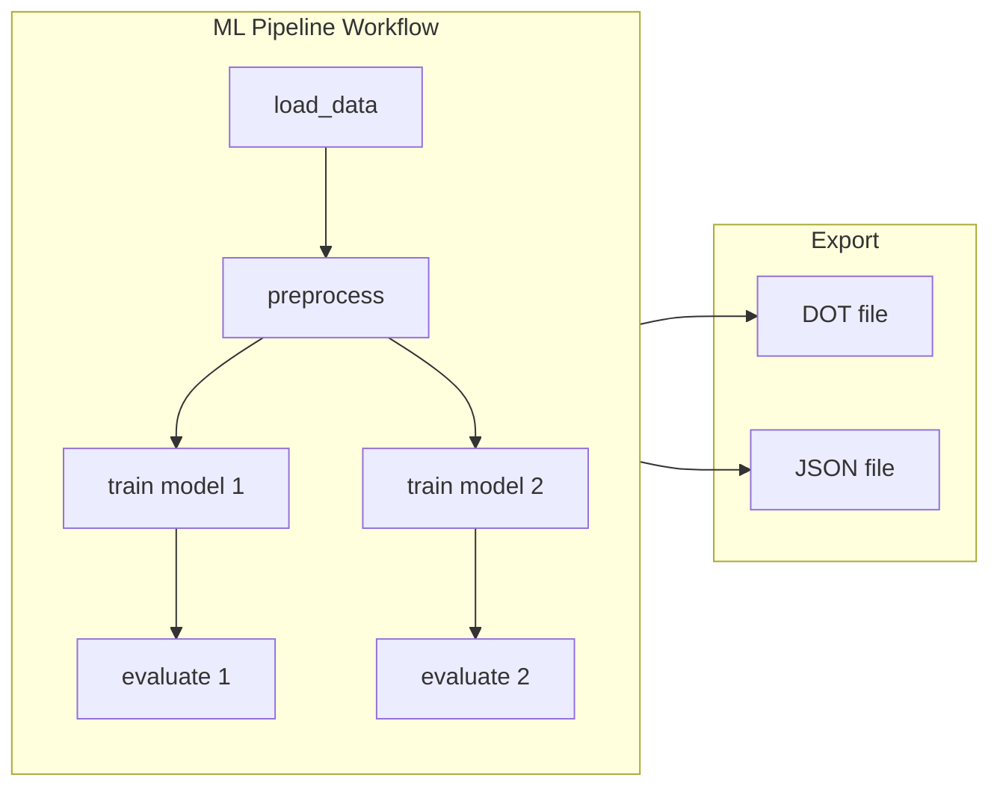

# Workflow Graph Visualization

This tutorial teaches you how to capture and visualize workflow structure using
callbacks. You will learn how to track task submissions, build dependency
graphs, and export them for visualization.



## Prerequisites

- Completion of the [Getting Started](getting_started_hello_world.md) tutorial.
- A Slurm cluster reachable by the SDK.
- Docker or Podman available locally.
- A Python environment with `slurm-sdk` installed.
- Graphviz installed locally (optional, for rendering DOT files).

## What you will build

- A custom callback that tracks workflow structure.
- A multi-stage ML pipeline workflow.
- DOT and JSON exports of the workflow graph.

## Concept: callbacks and workflows

- **Callback**: A class that receives events during job lifecycle (submit,
  complete, fail). Callbacks can run on client or cluster.
- **Workflow**: A special task that orchestrates other tasks. Workflows run
  on the cluster and submit child tasks.
- **WorkflowContext**: Injected into workflows, provides shared state and
  directories.

## 1) Understand the callback structure

Callbacks inherit from `BaseCallback` and override event methods:

```python
from slurm.callbacks import (
    BaseCallback,
    WorkflowCallbackContext,
    WorkflowTaskSubmitContext,
    SubmitBeginContext,
    SubmitEndContext,
)


class WorkflowGraphCallback(BaseCallback):
    """Build workflow dependency graph for visualization."""

    requires_pickling = False  # Client-side only

    def __init__(self):
        super().__init__()
        self.graph = {}
        self.submission_order = []

    def on_begin_submit_job_ctx(self, ctx: SubmitBeginContext):
        """Called when a job is about to be submitted."""
        if hasattr(ctx.task, "_is_workflow") and ctx.task._is_workflow:
            self.graph[ctx.pre_submission_id] = {
                "name": ctx.task.func.__name__,
                "type": "workflow",
                "children": [],
            }

    def on_workflow_task_submitted_ctx(self, ctx: WorkflowTaskSubmitContext):
        """Called when a workflow submits a child task."""
        if ctx.parent_workflow_id in self.graph:
            self.graph[ctx.parent_workflow_id]["children"].append({
                "job_id": ctx.child_job_id,
                "name": ctx.child_task_name,
            })
```

Key points:

- `requires_pickling = False` means the callback only runs on the client.
- Different event methods receive different context objects.
- The callback builds a graph dictionary as events occur.

## 2) Define a workflow with child tasks

Workflows use the `@workflow` decorator and accept a `WorkflowContext`:

```python
from slurm import task
from slurm.decorators import workflow
from slurm.workflow import WorkflowContext


@task(time="00:03:00", ntasks=1, cpus_per_task=1, mem="256M")
def load_data(dataset_name: str) -> dict:
    """Load dataset from disk."""
    return {"dataset": dataset_name, "rows": 1000, "cols": 10}


@task(time="00:03:00", ntasks=1, cpus_per_task=1, mem="256M")
def preprocess(data: dict) -> dict:
    """Preprocess the data."""
    return {**data, "preprocessed": True}


@task(time="00:03:00", ntasks=1, cpus_per_task=1, mem="256M")
def train_model(data: dict, model_type: str) -> dict:
    """Train a model on the data."""
    return {"model": model_type, "accuracy": 0.95, "data": data}


@task(time="00:03:00", ntasks=1, cpus_per_task=1, mem="256M")
def evaluate_model(model: dict) -> dict:
    """Evaluate model performance."""
    return {**model, "test_accuracy": 0.93}


@workflow(time="00:05:00", ntasks=1, cpus_per_task=1, mem="512M")
def ml_pipeline(dataset_name: str, ctx: WorkflowContext):
    """Complete ML pipeline from data loading to evaluation."""

    # Step 1: Load data
    data_job = load_data(dataset_name)
    data = data_job.get_result()

    # Step 2: Preprocess
    prep_job = preprocess(data)
    preprocessed = prep_job.get_result()

    # Step 3: Train models in parallel
    model1_job = train_model(preprocessed, "logistic_regression")
    model2_job = train_model(preprocessed, "random_forest")

    model1 = model1_job.get_result()
    model2 = model2_job.get_result()

    # Step 4: Evaluate models
    eval1_job = evaluate_model(model1)
    eval2_job = evaluate_model(model2)

    result1 = eval1_job.get_result()
    result2 = eval2_job.get_result()

    return {"model1": result1, "model2": result2}
```

Key points:

- The workflow runs as a Slurm job on the cluster.
- Child tasks are submitted from within the workflow.
- `get_result()` blocks until each child task completes.

## 3) Export the graph to DOT format

Add a method to export Graphviz DOT format:

```python
def export_dot(self) -> str:
    """Export graph in Graphviz DOT format."""
    lines = ["digraph workflow {"]
    lines.append("  rankdir=TB;")
    lines.append("  node [style=filled];")

    for job_id, data in self.graph.items():
        shape = "box" if data["type"] == "workflow" else "ellipse"
        fillcolor = "lightblue" if data["type"] == "workflow" else "lightgray"
        lines.append(
            f'  "{job_id}" [label="{data["name"]}" '
            f"shape={shape} fillcolor={fillcolor}];"
        )

    for job_id, data in self.graph.items():
        for child in data["children"]:
            lines.append(f'  "{job_id}" -> "{child["job_id"]}";')

    lines.append("}")
    return "\n".join(lines)
```

## 4) Run the example and export graphs

Execute the example:

```bash
uv run python -m slurm.examples.workflow_graph_visualization \
  --hostname your-slurm-host \
  --username $USER \
  --partition debug \
  --packaging container \
  --packaging-registry registry:5000/workflow-graph \
  --packaging-platform linux/amd64 \
  --packaging-tls-verify false
```

The example writes two files:

- `workflow_graph.dot`: Graphviz DOT format
- `workflow_graph.json`: JSON format for programmatic access

## 5) Render the graph with Graphviz

If you have Graphviz installed, render the DOT file:

```bash
dot -Tpng workflow_graph.dot -o workflow_graph.png
```

This creates an image showing the workflow structure with nodes and edges.

## 6) Understand the output

The example prints a summary:

```
Workflow completed!

Graph Summary:
  Root workflows: 1
  Total nodes: 7
  Submission order: 7

Graph Structure:
  Workflow: ml_pipeline (id=12345)
    └─> task: load_data (id=12346)
    └─> task: preprocess (id=12347)
    └─> task: train_model (id=12348)
    └─> task: train_model (id=12349)
    └─> task: evaluate_model (id=12350)
    └─> task: evaluate_model (id=12351)
```

The graph captures the parent-child relationships between the workflow and
its submitted tasks.

## What you learned

- How to create custom callbacks that track workflow events.
- How workflows submit and coordinate child tasks.
- How to export workflow graphs for visualization.
- How to use WorkflowContext in workflow definitions.

## Next steps

- [Parallel Train + Eval Workflow](parallel-train-eval-workflow.md): Build a
  more complex production-style workflow.
- Explore the callback API in the reference documentation for more event types.
