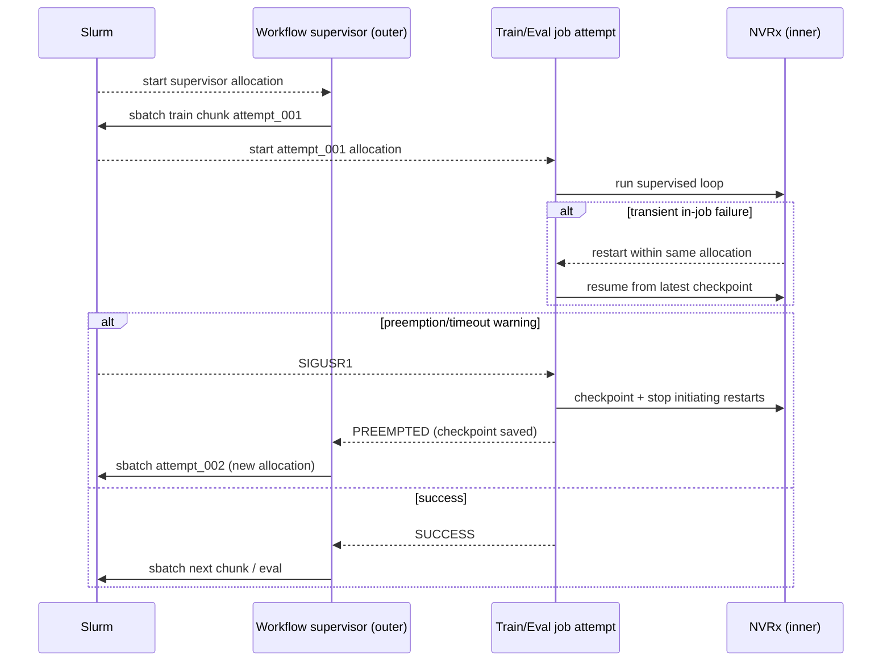

# Production parallel training + evaluation workflow (design + plan)

## Context
The current example (`src/slurm/examples/parallel_train_eval/`) demonstrates:
- Training split into sequential “chunks” (capped steps per job).
- Evaluation submitted after each epoch (not blocking training).
- A JSON `state.json` plus per-epoch checkpoint + metrics files.

The goal is to evolve this into a production-ready “Training Evaluation workflow” while still using mocked training/eval internals (no PyTorch implementation yet).

## Goals and non-goals

Goals:
- **High fault tolerance** across both job-level failures (preemption, node loss, timeouts) and in-job failures (rank crashes, NCCL hiccups, transient CUDA failures).
- **Resumability**: a run can be restarted at any time and converge to the same terminal outcome without manual cleanup.
- **Idempotent artifacts**: repeated submissions and retries never corrupt “good” outputs; the supervisor can always decide what to do from on-disk truth.
- **Clear ownership boundaries**: tasks write only inside their `output_dir`; the supervisor is the only writer of canonical run state and stable pointers.
- **Observability**: every unit of work produces a small, structured `result.json` plus append-only event logs for auditing/debug.

Non-goals (for the first production iteration):
- No hard dependency on an object store; filesystem `run_dir` only.
- No attempt to make evaluation “real-time” or bounded by default (optional lag caps may be added).
- No multi-supervisor leader election; enforce a single active supervisor via a lock.

## Requirements (from notes)

- Cluster launch support.
- Workflow is a **supervisor** that monitors/manages training chunks.
  - Detect errors and provide **retry** for recoverable errors (tasks communicate recoverability via results).
- Workflow needs **checkpointing / state management** for workflow timeouts / pre-emption.
  - Workflow may need to **re-submit itself** before pre-emption.
- Train + eval tasks register **signal handlers** to checkpoint progress when Slurm sends preemption/timeout signals.
- Train + eval tasks are **checkpointable**; use torch metrics throughout (can mock for now).
- Integrate an **inner, in-job supervisor** (NVIDIA Resiliency Extension / NVRx) inside train/eval tasks for process-level fault tolerance; keep the workflow as the scheduler-level supervisor for failures NVRx cannot resolve.
- Functional protocol:
  - **Args** contain everything needed to run a chunk, including the checkpoint to start from.
  - **Result** is `(status_code, status_summary, result_details)` where details are pointers to files; result is a small summary.

## Confirmed decisions
- `run_dir`: shared filesystem path only (no object-store requirement yet).
- Preemption/timeout: Slurm `--signal` warnings are available; both chaining and requeue are available.
- Retry policy: retry everything except user errors; train/eval tasks classify user errors.
- Eval lag: allowed with no max cap.
- Supervisor: single writer (no leader election required); enforce at-most-one active supervisor with a run-level lock in `run_dir/state/`.

## High-level design

### Key decision: stable run directory (don’t rely on `WorkflowContext.shared_dir`)
`WorkflowContext.shared_dir` lives under the orchestrator job directory, which changes if the workflow re-submits itself. For resumability, define a stable `run_dir` (remote path) that survives across supervisor job attempts.

Proposed:
- The launcher chooses a `run_id` and `run_dir` (e.g. `~/slurm_jobs/runs/<run_id>`).
- Every supervisor/train/eval job writes artifacts *only* under `run_dir/...`.
- The supervisor stores canonical state under `run_dir/state/state.json`.

### Layered supervision (outer workflow + inner NVRx)

This design intentionally uses two supervisory layers:

| Layer | Scope | Handles | Cannot handle well |
|---|---|---|---|
| **NVRx (inner)** | Within a single Slurm allocation (a single job attempt) | Transient in-job failures (rank crash, collective timeout, flaky interconnect), bounded restarts, local health monitoring, rapid “retry without reschedule” | Losing the allocation (preemption), hitting Slurm time limit, node drained, persistent deterministic bugs, repeated failures beyond restart budget |
| **Workflow supervisor (outer)** | Across Slurm jobs and attempts | Preemption/timeout survival (requeue/chaining), resubmission onto fresh nodes, escalating resources, long-horizon retries, global run state | Fixing in-job issues without restarting/rescheduling the job |

Goal: **NVRx keeps a job attempt alive and productive**, while the workflow ensures the run completes even if entire attempts are lost.

Execution sketch:



### Run lock (single active supervisor via lease)

Because requeue/chaining and user-driven “resume” can accidentally start multiple supervisors, the run needs a simple, durable mutual exclusion mechanism.

Recommended approach: a **lease-based directory lock** under `run_dir/state/`:

- Supervisor acquires the lock via atomic `mkdir` of `run_dir/state/supervisor.lock/`.
- It writes an `owner.json` (job ID, host, pid, start time) and updates a `heartbeat.json` periodically.
- A new supervisor attempt treats the lock as **active** if:
  - the recorded job ID is still running, or
  - the heartbeat is fresh (within a configured TTL).
- A new attempt may **steal** the lock only if the job is not running and the heartbeat is stale (e.g., prior supervisor was killed).

This provides “single writer” safety without requiring leader election or external coordination.

### Components

1. **Launcher (client-side CLI / module)**
   - Creates/configures `Cluster`.
   - Determines `run_id`, `run_dir`, and submits the supervisor workflow.
   - Optional: “local dev cluster launch” (docker compose) to start the test Slurm container environment.

2. **Supervisor workflow**
   - Loads state from `run_dir/state/state.json` (or initializes it).
   - Reconciles current progress by inspecting state + filesystem + (optionally) Slurm job statuses.
   - Submits train chunks and eval jobs with correct dependencies.
   - Implements retry logic based on task results and job status.
   - Implements self-resubmission strategy to survive fair-share timeouts/preemption.

3. **Train chunk task**
   - Pure(ish) function: reads input checkpoint + run config, produces a new checkpoint + metrics/log artifacts in an *output directory passed in args*.
   - Registers signal handlers to checkpoint on preemption/timeout warnings.
   - Optionally wraps the training loop with NVRx so transient in-job failures restart the loop within the same allocation.
   - Returns standardized `TaskResult` (see protocol below).

4. **Eval task**
   - Same pattern as train: reads a checkpoint, writes eval metrics/artifacts, supports signal-triggered “partial metrics” checkpointing.
   - Optionally uses NVRx for distributed eval or long-running validation passes.

## Artifact layout (under `run_dir`)
Recommended deterministic, idempotency-friendly structure:

```text
run_dir/
  state/
    state.json
    supervisor.lock/           # lease-based lock directory (owner + heartbeat)
    events.jsonl               # optional append-only event log
  config/
    run_config.json            # frozen run configuration
  train/
    epoch_000/
      chunk_000/
        attempt_001/
          input.json
          checkpoint_in.json   # or pointer/reference
          progress.json        # updated during execution (atomic replace)
          checkpoint_out.json
          metrics.jsonl
          result.json
          nvrx/
            events.jsonl       # optional: inner supervisor events
            summary.json       # optional: restart counts, last error, etc.
          logs/
    epoch_001/...
  eval/
    epoch_000/
      attempt_001/
        input.json
        progress.json
        metrics.json
        result.json
        nvrx/
          events.jsonl
          summary.json
  exports/
    latest_checkpoint.json     # stable pointer updated by supervisor
    best_checkpoint.json
```

Principles:
- Each task writes only inside its assigned `output_dir` (passed via args).
- The supervisor is the only writer of `state/state.json` and stable pointers in `exports/`.
- Every write that can be interrupted should be atomic (write temp → rename).
- A unit of work is considered **terminal** only when `result.json` exists and indicates a terminal status.

## Idempotency and atomicity contract

To make reconciliation and retry safe, enforce a small set of invariants:

- **Attempt directories are immutable contracts**: `epoch/chunk/attempt` is the unit of workflow-level retry. The workflow always creates a new `attempt_###/` directory; in-job restarts (NVRx) reuse the same attempt directory.
- **`result.json` is the commit record**: tasks must write `result.json` last; the supervisor treats the attempt as incomplete otherwise.
- **Atomic snapshots**:
  - Tasks update `progress.json` via atomic replace.
  - Supervisor updates `state.json` via atomic replace and may additionally append to `events.jsonl`.
- **Deterministic paths**: input/output paths are computable from `(run_id, epoch, chunk, attempt)` so the supervisor can submit jobs without blocking on prior job results just to learn filenames.

This makes the supervisor loop “stateless” beyond `state.json`: it can always derive what to do from disk.

## Task protocol (arguments and results)

### Status codes
Define a small, explicit enum (string values for JSON friendliness):
- `SUCCESS`
- `RETRYABLE_ERROR` (transient; safe to retry)
- `NONRETRYABLE_ERROR` (user/config/code error; fail the run)
- `PREEMPTED` (caught signal and checkpointed; safe to retry/resume)
- `TIMEOUT` (task exceeded time cap; may be retryable if checkpointed)
- `CANCELLED` (supervisor-initiated cancellation; treat as terminal)

### Result shape
Use a single structured object rather than a raw tuple for extensibility, but keep the semantic tuple fields:

```python
TaskResult = {
  "schema_version": 1,
  "status_code": "...",
  "status_summary": "...",
  "result_details": {
    "output_dir": "...",
    "checkpoint_out": "...",
    "metrics_path": "...",
    "events_path": "...",
    "slurm": {
      "job_id": "...",
      "array_job_id": "...",
      "array_task_id": "...",
      "hostname": "...",
    },
    "nvrx": {
      "enabled": True,
      "restarts": 2,
      "summary_path": "...",
      "events_path": "...",
    },
    "error_type": "...",
    "error_message": "...",
    "error_class": "user|transient|system",
    "retry_after_s": 30,
    "debug": {...},
  }
}
```

The workflow can still treat this as `(status_code, status_summary, result_details)` logically.

### Train chunk args (functional)
```python
TrainChunkInput = {
  "run_id": "...",
  "run_dir": "...",
  "epoch": 0,
  "chunk": 3,
  "start_step": 1200,
  "max_steps": 400,
  "global_epoch_steps": 10000,
  "checkpoint_in": "path-or-uri",
  "output_dir": "run_dir/train/epoch_000/chunk_003/attempt_001",
  "data_config": {...},
  "train_config": {...},   # hyperparams, seed, precision, etc.
  "resources": {...},      # optional: world size, gpus, etc.
  "signal_config": {...},  # what to do on SIGTERM/SIGUSR1
  "resiliency_config": {...},  # optional: NVRx settings
}
```

### Eval args (functional)
```python
EvalInput = {
  "run_id": "...",
  "run_dir": "...",
  "epoch": 0,
  "checkpoint_in": "...",
  "output_dir": "run_dir/eval/epoch_000/attempt_001",
  "eval_config": {...},
  "signal_config": {...},
  "resiliency_config": {...},
}
```

## Supervisor behavior

### State machine (conceptual)
At minimum track:
- Run config (frozen)
- Current epoch/chunk boundaries and completion
- For each epoch:
  - Latest successful train checkpoint reference
  - Train chunk attempts and their results
  - Eval attempt (submitted/completed) and metrics path
  - “Best model so far” decision inputs
- Outstanding jobs (IDs) and their purpose (for reconciliation after a restart)

Recommended additions:
- `schema_version` and `state_revision` (monotonic) to support safe evolution and easier debugging.
- Per-unit “desired state” vs “observed state” so reconciliation can be reasoned about deterministically.
- A run-level `stop_requested` flag (and optional `stop_reason`) so users can request cancellation without SSHing into running jobs.

### Scheduling model
1. **Within an epoch**: training chunks run sequentially:
   - `chunk(n+1)` depends on `chunk(n)` (or depends on “latest_checkpoint” written by supervisor).
2. **Across epochs**:
   - Eval(epoch=k) depends on “epoch k training complete”.
   - Training of epoch k+1 may start immediately after epoch k completes, without waiting for eval(epoch=k).

### Retry policy

Supervisor retries when:
- Task returns `PREEMPTED` / `TIMEOUT` with a usable checkpoint pointer.
- Task returns `RETRYABLE_ERROR` (optionally with `retry_after_s`).
- Job fails unexpectedly but supervisor classifies it as transient (node failure, preemption), and a prior checkpoint exists.

Supervisor does **not** retry when:

- `NONRETRYABLE_ERROR` (user error)
- Exceeded `max_attempts` for that unit of work (chunk or epoch eval)

Retry knobs:

- `max_train_chunk_attempts`
- `max_eval_attempts`
- exponential backoff with jitter
- resource escalation policy (optional): increase `mem`, change partition, reduce concurrency, etc.

### Supervisor loop (recommended: do not block on `get_result()`)
To keep the supervisor compatible with time limits and requeues, structure it as a reconcile loop:

1. Acquire the run lock (exit if another active supervisor holds it).
2. Load `state.json` (or initialize).
3. Inspect filesystem for completed `result.json` records and update observed state.
4. Optionally query Slurm for known job IDs to refine observed state (running/failed/preempted).
5. Compute the next desired actions (submit next chunk, submit eval, retry, stop).
6. Persist updated `state.json` and append an event to `events.jsonl`.
7. Sleep/backoff and repeat.

This avoids long blocking waits and makes “kill -9” survivable: the next supervisor attempt can re-derive the world from disk.

### Reconciliation after supervisor restart

On every supervisor start:
- Load `state.json`.
- Validate on-disk artifacts referenced by state (checkpoints/metrics exist).
- Optionally query Slurm (`squeue`/`sacct`) for recorded job IDs to determine whether they are running/completed/failed.
- For any “submitted but unknown” jobs, decide whether to wait, resubmit, or mark as failed based on policy + timeouts.

## Workflow self-resubmission (survive preemption/timeouts)

Two supported strategies (make this a run config choice; both are available on your clusters):

### Strategy A: requeue

- Submit supervisor with `--requeue` and `--signal=B:USR1@<grace_seconds>`.
- On `SIGUSR1`, supervisor flushes state and exits in a way that triggers requeue (cluster policy dependent; document expected behavior).
- On restart, supervisor resumes from `run_dir/state/state.json`.

### Strategy B: chaining (portable)
- Early in execution, supervisor submits a single continuation run of itself with `dependency=afterany:<current_job_id>`.
- The continuation job immediately exits if `state.json` says the run is complete.
- This guarantees the run continues if the current supervisor is preempted or times out.

Notes:
- Chaining creates a bounded chain (one successor per supervisor run).
- Requeue reduces job churn, but relies on consistent cluster requeue behavior.
- The run lock in `run_dir/state/` is the final backstop against accidental concurrent supervisors (e.g., user launches the same `run_id` twice).

## Task signal handling (train + eval)

Each task should:

- Register handlers for `SIGUSR1` (timeout warning) and `SIGTERM` (preemption/termination).
- On signal:
  - Write an intermediate checkpoint (or “progress file”) into its `output_dir`.
  - Flush metrics/events.
  - Return a `TaskResult` with `status_code="PREEMPTED"` if it can exit cleanly, or ensure the next retry can resume from the saved checkpoint.

Slurm integration:
- Ensure tasks are submitted with SBATCH `--signal=B:USR1@<seconds>` so they reliably receive a warning.
- Optionally set `--requeue` if the cluster supports it (configurable).

Mock implementation approach (now):
- Replace “torch checkpoint” with JSON progress + a “checkpoint_out.json” containing `steps_completed` and seed.
- Replace “torch metrics” with JSONL metrics that mimics step-level logging.

## In-job fault tolerance with NVRx (NVIDIA Resiliency Extension)

Reference: https://nvidia.github.io/nvidia-resiliency-ext/

### Why NVRx fits this design
Chunking + checkpointing makes the workflow resilient to losing whole jobs. NVRx complements this by reducing how often jobs are lost in the first place by recovering from transient in-job failures without needing Slurm to reschedule.

### Responsibility split (important)
Design rule: **NVRx may restart work within an attempt; only the workflow may create a new attempt.**

- NVRx restarts should be “invisible” to the workflow (no job ID change); they only affect in-attempt artifacts (`progress.json`, NVRx logs).
- If NVRx exhausts its restart budget or detects a non-recoverable error, the task should terminate and return a `TaskResult` that lets the workflow decide whether to resubmit on fresh resources.

### Integration points in train/eval tasks
Each task gets a `resiliency_config` block, e.g.:

- `enabled`: bool
- `max_restarts`: int (within a single Slurm allocation)
- `restart_window_s`: int (optional time window for restarts)
- `checkpoint_interval_s` or `checkpoint_interval_steps`: how frequently to make a restart-safe checkpoint
- `failure_classes`: which failures are considered retryable-in-job (library-specific)

Operational pattern:
1. Task starts, writes `input.json`, and initializes logging.
2. Task initializes NVRx (if enabled) and registers:
   - a **checkpoint callback** that writes into `output_dir/` atomically
   - an **event sink** writing `output_dir/nvrx/events.jsonl`
3. Training/eval loop runs under NVRx supervision.
4. On transient failure, NVRx triggers a restart and resumes from the latest checkpoint inside the same `attempt_###/`.
5. On Slurm `SIGUSR1`/`SIGTERM`, task requests a final checkpoint, emits `PREEMPTED`, and exits so the workflow can resubmit if needed.
6. On completion, task writes `result.json` with an `nvrx` summary (restart count, last error, etc.).

### Time-budget coordination with Slurm
To avoid “recovering forever” and missing the Slurm deadline:

- Choose `--signal=B:USR1@<grace_seconds>` such that `<grace_seconds>` comfortably covers a worst-case checkpoint + filesystem flush.
- On `SIGUSR1`, the task should:
  - request an immediate checkpoint via its normal checkpoint path,
  - stop initiating new in-job restarts, and
  - exit cleanly with `PREEMPTED`/`TIMEOUT` semantics so the workflow can resubmit.
- Configure NVRx restart policies with awareness of the outer time limit (bounded restart counts and/or windows).

### Packaging and rollout
- Make NVRx optional behind `resiliency_config.enabled` so the workflow can run in environments where the library is not installed.
- If `enabled=True` but NVRx is unavailable/import fails, return `NONRETRYABLE_ERROR` with a clear message pointing to the missing dependency (this is an environment/packaging problem, not a transient runtime failure).

### Failure mapping between layers
Recommended mapping for a task using NVRx:

- **Recovered in-job**: NVRx restarts and continues; task remains running; workflow sees nothing.
- **NVRx gives up** (restart budget exceeded): task returns `RETRYABLE_ERROR` with `error_class="transient"` and includes NVRx summary; workflow creates a new attempt (new Slurm allocation).
- **Deterministic/user error** (bad config/data): task returns `NONRETRYABLE_ERROR` with `error_class="user"`; workflow fails fast.
- **Preemption/timeout signal**: task returns `PREEMPTED` / `TIMEOUT` (with a usable checkpoint) regardless of NVRx; workflow resubmits.

This keeps policy centralized: NVRx decides what it can fix locally; the workflow decides what requires rescheduling/escalation.

### Efficiency notes
- With NVRx enabled, you can often increase chunk sizes (fewer Slurm submissions) while maintaining high completion probability, as long as checkpointing interval is sufficiently small for restarts.
- Keep NVRx restart budgets bounded so jobs do not spin indefinitely and miss Slurm time limits; the workflow remains the place to implement longer backoff and resource changes.

## Cluster launch support
Interpretation for production:
- **Run launcher**: a stable CLI that creates the cluster, submits the workflow, and (optionally) monitors it.
- **Optional local dev cluster**: a flag to start/stop the local docker-compose Slurm cluster (reuse `containers/docker-compose.yml` patterns used by integration tests).

Proposed CLI UX:
- `python -m slurm.examples.production_parallel_train_eval.launch --slurmfile ... --run-id ... --run-dir ...`
- Optional: `--launch-local-cluster` and `--keep-local-cluster`

## Plan of record (incremental implementation)

### Phase 0: clarify contract + schemas (no PyTorch yet)
- Define `TaskResult` schema and `TrainChunkInput` / `EvalInput` schemas.
- Define state schema versioning (`state["schema_version"]`).
- Decide run directory + artifact layout.

### Phase 1: supervisor resumability + idempotency
- Implement supervisor that can:
  - Initialize run state.
  - Resume from state after being killed/restarted.
  - Reconcile using files-on-disk (minimal reliance on Slurm queries).
- Ensure every chunk/eval writes deterministic outputs based on `(epoch, chunk, attempt)`.

### Phase 2: retries + recoverable errors

- Implement retry loops for:
  - train chunk unit
  - eval unit
- Add backoff and max-attempts.
- Make mocked train/eval tasks able to return retryable vs nonretryable codes (injectable “failure modes” for testing).

### Phase 3: signal handling + preemption safety

- Add SBATCH `--signal` support to train/eval submissions (and supervisor).
- Add signal handlers to mocked tasks that checkpoint progress and return `PREEMPTED` semantics.
- Add supervisor “continuation job” pattern (`afterany`) + “done-fast-exit”.

### Phase 4: cluster launch support

- Add a launcher module that:
  - Supports Slurmfile-based config (preferred) and/or `Cluster.add_argparse_args`.
  - Supports local docker-compose cluster launch for development (optional but aligns with existing repo tooling).

### Phase 5: production hooks (still mocked training)

- Add integration points (no heavy dependencies yet):
  - “metrics sink” abstraction: JSONL now, torchmetrics later.
  - “checkpoint store” abstraction: filesystem now, object store later.
  - “early stopping” + “best checkpoint selection” logic based on eval metrics.

### Phase 6: NVRx integration (optional feature flag)
- Add `resiliency_config` plumbing and task wrappers so train/eval can run with NVRx when the library is available in the runtime environment/container.
- Persist NVRx event logs and summaries under `output_dir/nvrx/` and surface a compact summary in `TaskResult`.

## Next design refinements (optional)

- Standardize the default continuation strategy (`requeue` vs chaining) and keep the other as a fallback.
- Define the exact “user error” classifier contract in train/eval (examples: schema validation, missing data, deterministic exceptions) and map to `NONRETRYABLE_ERROR`.
- Add optional `max_eval_lag` and “eval backpressure” so evaluation can be capped or coalesced in very long runs if desired.
